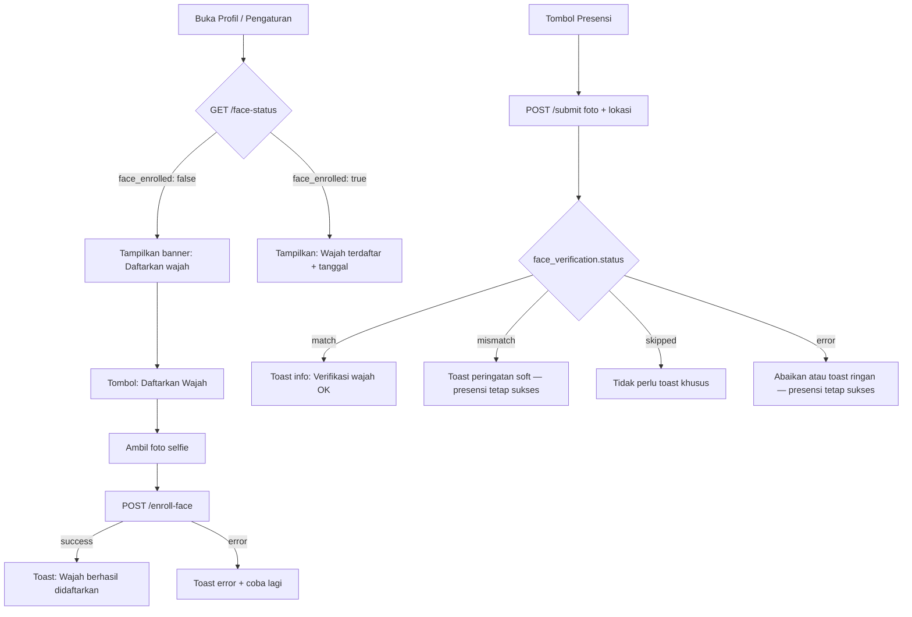

# API Absensi (Presensi Pegawai)

API untuk presensi datang/pulang dari aplikasi mobile atau client lain. Autentikasi menggunakan **Laravel Sanctum** (Bearer token).

> **Tim mobile — Verifikasi wajah (InsightFace):**  
> - Panduan implementasi UI & capture: [`docs/FRONTEND_INSIGHTFACE_PRESENSI.md`](docs/FRONTEND_INSIGHTFACE_PRESENSI.md)  
> - Ringkasan API di dokumen ini: [Panduan Tim Mobile](#verifikasi-wajah-insightface--panduan-tim-mobile)  
> - Spesifikasi backend: [`docs/BACKEND_INSIGHTFACE_PRESENSI.md`](docs/BACKEND_INSIGHTFACE_PRESENSI.md)

---

## Testing dengan Postman

### Persiapan

1. **Base URL** — Sesuaikan dengan server Anda, mis. `http://localhost/sikat/public` atau `http://sikat.test` (jika pakai Valet/Herd).
2. **Pastikan server Laravel berjalan** (XAMPP Apache + MySQL, atau `php artisan serve`).

### Langkah 1: Login (dapat token)

| Field | Nilai |
|-------|-------|
| Method | `POST` |
| URL | `{{base_url}}/api/login` |
| Headers | `Content-Type: application/json` |
| Body (raw JSON) | `{"username": "NIK_pegawai", "password": "password_user"}` |

**Contoh Body:**
```json
{
  "username": "278.21.11.2018",
  "password": "password_anda"
}
```

**Response:** Copy nilai `data.token` (mis. `1|abc123xyz...`) untuk dipakai di langkah berikutnya.

### Langkah 2: Set token untuk request berikutnya

Di Postman, buat **Environment** atau set header manual:
- **Key:** `Authorization`
- **Value:** `Bearer 1|abc123xyz...` (ganti dengan token dari login)

Atau gunakan **Authorization** tab → Type: **Bearer Token** → paste token (tanpa kata "Bearer").

### Langkah 3: Test endpoint absensi

| Endpoint | Method | Keterangan |
|----------|--------|-------------|
| Jadwal hari ini | `GET` `{{base_url}}/api/absensi/jadwal-hari-ini` | Cek shift & jam masuk/pulang |
| Status hari ini | `GET` `{{base_url}}/api/absensi/status-hari-ini` | Cek status: belum / datang / selesai |
| Config lokasi | `GET` `{{base_url}}/api/absensi/config` | Titik & radius presensi |
| Submit presensi | `POST` `{{base_url}}/api/absensi/submit` | Butuh body (lihat di bawah) |
| Status enroll wajah | `GET` `{{base_url}}/api/absensi/face-status` | Cek sudah daftar wajah atau belum |
| Enroll wajah | `POST` `{{base_url}}/api/absensi/enroll-face` | Daftar wajah referensi (opsional) |
| Verifikasi wajah | `POST` `{{base_url}}/api/absensi/verify-face` | Cek wajah sebelum submit (tanpa simpan presensi) |
| Riwayat | `GET` `{{base_url}}/api/absensi/riwayat?bulan=2&tahun=2026` | Riwayat per bulan |

### Langkah 4: Submit presensi (POST /api/absensi/submit)

**Opsi A — JSON dengan base64 image:**
- Method: `POST`
- URL: `{{base_url}}/api/absensi/submit`
- Headers: `Content-Type: application/json`, `Authorization: Bearer {token}`
- Body (raw JSON):
```json
{
  "image": "data:image/jpeg;base64,/9j/4AAQSkZJRg...",
  "latitude": -7.4856,
  "longitude": 112.6527,
  "is_mock_location": false
}
```

**Opsi B — Form-data (file):**
- Method: `POST`
- Body: pilih **form-data**
- Key `image`: type **File**, pilih file JPEG/PNG (max 2MB)
- Key `latitude`: `-7.4856`
- Key `longitude`: `112.6527`
- Key `is_mock_location`: `false` (opsional)

**Untuk base64:** Bisa convert gambar ke base64 di [base64-image.de](https://www.base64-image.de/) atau pakai script. Atau gunakan form-data agar lebih mudah.

### Tips

- **Lokasi:** Pastikan `latitude` dan `longitude` dalam radius yang diizinkan (lihat dari `GET /api/absensi/config`).
- **Fake GPS:** Jika `is_mock_location: true`, server akan menolak (403).
- **Rate limit:** Maks 10 submit per menit per IP; jika 429, tunggu sebentar.
- **Verifikasi wajah:** Setelah login, uji `GET /api/absensi/face-status` lalu `POST /api/absensi/enroll-face` sebelum submit — lihat [Panduan Tim Mobile](#verifikasi-wajah-insightface--panduan-tim-mobile).
- **Datang vs rekap:** Satu kali submit **pertama** (datang) → data masuk ke **temporary_presensi**. Cek response: jika `"tipe": "datang"` artinya masuk temporary. Jika Anda submit **dua kali**, request kedua dianggap **pulang** → data dipindah ke **rekap_presensi** dan dihapus dari temporary. Jadi kalau Anda lihat data cuma di rekap, kemungkinan submit sudah dua kali. Untuk uji datang saja: submit **sekali**, lalu cek tabel **temporary_presensi** (koneksi **server_74**, lihat `.env` / `config/database.php`).

### Timezone (WIB) dan keterlambatan

- Semua perhitungan **jam datang**, **keterlambatan**, dan **jam masuk shift** memakai **Asia/Jakarta (WIB)**.
- Server membandingkan **waktu submit** (WIB) dengan **jam_masuk** shift (dipakai sebagai “hari ini” 07:00 WIB untuk shift pagi). Jika submit jam 06:27 WIB dan shift pagi 07:00 → **Tepat Waktu**; jika submit 07:15 WIB → Terlambat.
- Pastikan **config `app.timezone`** di server (atau `APP_TIMEZONE` di `.env`) konsisten. Disarankan **Asia/Jakarta**. Jika server pakai UTC tanpa aturan eksplisit, bisa muncul kasus “masuk 06:27 tapi tercatat terlambat”.

---

## Autentikasi

### Login (dapat token)

```http
POST /api/login
Content-Type: application/json

{
  "username": "NIK_pegawai",
  "password": "password_user"
}
```

**Response sukses (200):**
```json
{
  "success": true,
  "message": "Login berhasil.",
  "data": {
    "token": "1|xxxxxxxxxxxx",
    "token_type": "Bearer",
    "user": {
      "id": 1,
      "name": "Nama Pegawai",
      "username": "278.21.11.2018"
    }
  }
}
```

Untuk setiap request API absensi di bawah, tambahkan header:

```http
Authorization: Bearer 1|xxxxxxxxxxxx
```

### Logout (cabut token)

```http
POST /api/logout
Authorization: Bearer 1|xxxxxxxxxxxx
```

---

## Endpoint Absensi

Base URL: `/api/absensi/`

### 1. Jadwal hari ini

```http
GET /api/absensi/jadwal-hari-ini
Authorization: Bearer {token}
```

Mengembalikan shift dan jam masuk/pulang **efektif** hari ini. Untuk **shift malam** (mis. 21:00–07:00) yang dijadwalkan di **hari pulang** (besok) di `jadwal_pegawai`: jika saat ini sudah ≥ jam masuk shift (mis. sudah 21:00), backend menganggap shift itu "dimulai hari ini" dan mengembalikannya. Dengan demikian presensi datang jam 21:00 akan tampil jadwalnya dan bisa submit.

**Response (200):**
```json
{
  "success": true,
  "data": {
    "jadwal_ada": true,
    "shift": "Pagi2",
    "jam_masuk": "07:00:00",
    "jam_pulang": "15:00:00"
  }
}
```

---

### 2. Status presensi hari ini

```http
GET /api/absensi/status-hari-ini
Authorization: Bearer {token}
```

Mengecek dari `temporary_presensi` dulu (presensi via API/web yang belum pulang), lalu `rekap_presensi` jika sudah pulang.

**Response (200):**
```json
{
  "success": true,
  "data": {
    "status": "belum",
    "jam_datang": null,
    "jam_pulang": null,
    "record_tertinggal": null,
    "presensi_belum_pulang": null
  }
}
```

`status`: `belum` | `datang` | `selesai`

**Field tambahan:**

| Field | Keterangan |
|-------|------------|
| `record_tertinggal` | Ada presensi datang hari sebelumnya tanpa pulang; `{ ada, jam_datang, tanggal, shift }` atau `null` |
| `presensi_belum_pulang` | Baris `temporary_presensi` terbuka (belum pulang); `{ jam_datang, jam_datang_time, tanggal, shift, status, keterlambatan }` atau `null` |

---

### 3. Konfigurasi lokasi (titik presensi & radius)

Nilai ini diambil dari **config server** (lihat di bawah: *Di mana mengubah radius?*). Response **di-cache 10 menit** di server; client boleh cache di app untuk kurangi panggilan.

```http
GET /api/absensi/config
Authorization: Bearer {token}
```

**Response (200):**
```json
{
  "success": true,
  "data": {
    "target_latitude": -7.485628943494862,
    "target_longitude": 112.6527141877153,
    "allowed_radius_meter": 30
  }
}
```

---

### 4. Submit presensi (datang atau pulang)

Sistem otomatis mendeteksi: jika belum ada presensi hari ini = **datang**, jika sudah ada datang tapi belum pulang = **pulang**.

```http
POST /api/absensi/submit
Authorization: Bearer {token}
Content-Type: application/json
```

**Body (JSON):**
```json
{
  "image": "data:image/jpeg;base64,/9j/4AAQ...",
  "latitude": -7.4856,
  "longitude": 112.6527,
  "is_mock_location": false
}
```

Atau kirim **file** dengan `Content-Type: multipart/form-data`:

- `image`: file gambar (JPEG/PNG, max 2MB)
- `latitude`: number
- `longitude`: number
- `is_mock_location`: boolean (opsional, default false). Jika `true` → response 403 Fake GPS.

**Response sukses datang (200):**
```json
{
  "success": true,
  "message": "Presensi datang berhasil dicatat.",
  "data": {
    "tipe": "datang",
    "jam_datang": "2026-01-30T07:15:00+07:00",
    "status": "Terlambat Toleransi",
    "keterlambatan": "00:15:00"
  },
  "face_verification": {
    "nik": "278.21.11.2018",
    "nama": "Ahmad Subagiyo",
    "status": "match",
    "score": 99,
    "verified": true,
    "message": "Wajah terverifikasi: Ahmad Subagiyo"
  }
}
```

*Field `face_verification` selalu ada jika fitur InsightFace aktif di server. Verifikasi membandingkan foto dengan wajah referensi **pegawai yang login** (`nik` / `nama` dari akun token). Fase 1 (**soft mode**): **tidak pernah memblokir** presensi — lihat [Panduan Verifikasi Wajah — Tim Mobile](#verifikasi-wajah-insightface--panduan-tim-mobile) di bawah.*

| Field | Arti |
|-------|------|
| `nik` | NIK pegawai yang login (identitas yang dicek) |
| `nama` | Nama pegawai yang login — **tampilkan di UI** saat `verified: true` |
| `status` | `skipped` \| `match` \| `mismatch` \| `error` |
| `score` | Similarity `0`–`100` atau `null` |
| `verified` | `true` hanya jika wajah cocok dengan akun login |
| `message` | Teks siap tampil (toast/label), bisa `null` pada `error` |
| `audit_notice` | *(mode soft + mismatch saja)* Peringatan audit SDI — tampilkan dialog konfirmasi |
| `show_confirm_dialog` | *(mode soft + mismatch saja)* `true` → mobile tampilkan "Apakah yakin lanjut?" |

| `face_verification.status` | Arti | Presensi |
|----------------------------|------|----------|
| `skipped` | Belum enroll wajah via API, atau fitur nonaktif | Tetap sukses |
| `match` | Wajah cocok dengan pegawai login (`score` ≥ threshold, default 70) | Tetap sukses |
| `mismatch` | Wajah tidak cocok — presensi **tetap sukses** (soft); tampilkan `audit_notice` | Tetap sukses |
| `error` | InsightFace timeout / down / foto tidak valid | Tetap sukses |

**Contoh response mismatch (soft) — presensi sukses + peringatan:**

```json
{
  "success": true,
  "message": "Presensi datang berhasil dicatat.",
  "data": { "tipe": "datang", "..." : "..." },
  "face_verification": {
    "nik": "278.21.11.2018",
    "nama": "Ahmad Subagiyo",
    "status": "mismatch",
    "score": 38,
    "verified": false,
    "message": "Wajah tidak cocok dengan Ahmad Subagiyo",
    "audit_notice": "Wajah tidak cocok dengan data profil Anda. Apakah Anda yakin ingin melanjutkan presensi? Seluruh aktivitas presensi dapat diaudit oleh SDI.",
    "show_confirm_dialog": true
  }
}
```

*Catatan UX:* Di mode soft, verifikasi server jalan **setelah** presensi tersimpan. Dialog `audit_notice` efektif jika mobile juga cek wajah **sebelum** kirim (descriptor lokal). Jika mismatch terdeteksi server setelah submit, mobile tetap bisa tampilkan peringatan + catat log audit.

*Catatan: `status` dengan `" & PSW"` muncul saat **pulang** jika jam pulang aktual sebelum jam pulang jadwal.*

**Response sukses pulang (200):**
```json
{
  "success": true,
  "message": "Presensi pulang berhasil dicatat.",
  "data": {
    "tipe": "pulang",
    "jam_datang": "2026-01-30T07:15:00+07:00",
    "jam_pulang": "2026-01-30T15:05:00+07:00",
    "durasi": "07:50:00",
    "status": "Tepat Waktu & PSW"
  },
  "face_verification": {
    "nik": "278.21.11.2018",
    "nama": "Ahmad Subagiyo",
    "status": "match",
    "score": 97,
    "verified": true,
    "message": "Wajah terverifikasi: Ahmad Subagiyo"
  }
}
```
*PSW muncul jika pulang sebelum jam pulang jadwal. `face_verification` juga dikirim saat **pulang** (informatif, soft mode).*

**Response sukses pulang (closing record tertinggal) (200):**

Terjadi jika ada record datang tanpa pulang dari hari sebelumnya; satu presensi hanya menutup (closing) record tersebut. Pegawai wajib presensi lagi untuk datang hari ini:

```json
{
  "success": true,
  "message": "Presensi pulang (closing) berhasil dicatat. Silakan lakukan presensi datang untuk hari ini.",
  "data": {
    "tipe": "pulang",
    "is_closing": true,
    "jam_datang": "2026-02-23T06:45:00+07:00",
    "jam_pulang": "2026-02-24T07:01:00+07:00",
    "durasi": "24:16:00",
    "status": "Tepat Waktu & PSW"
  }
}
```

*`is_closing: true` menandakan ini closing record tertinggal. Karena 24/02 07:01 sebelum jam pulang jadwal → status PSW.*

**Response error Fake GPS (403):**
```json
{
  "success": false,
  "message": "Fake GPS terdeteksi. Presensi tidak dapat dilakukan.",
  "is_fake_gps": true
}
```

**Response error di luar radius (400):**
```json
{
  "success": false,
  "message": "Anda berada di luar radius presensi. Jarak: 150 m (maks 30 m).",
  "distance_meter": 150.5,
  "allowed_radius_meter": 30
}
```

**Response error tidak ada jadwal shift (400):**
```json
{
  "success": false,
  "message": "Tidak ada jadwal shift hari ini."
}
```

Ini muncul hanya saat pegawai akan **presensi datang** (belum ada `temporary_presensi` terbuka hari ini dan tidak ada record tertinggal). **Presensi pulang** (sudah ada datang, belum pulang — termasuk **closing** record hari sebelumnya) **tidak** membutuhkan jadwal shift hari ini; jam shift diambil dari **shift yang tercatat di record** (mis. hari libur tetap bisa pulang).

Selain itu, backend menolak karena **tidak menemukan shift** untuk pegawai tersebut pada **tanggal hari ini (WIB)** untuk **datang baru**.

**Yang dicek backend:**

1. Ada baris **`jadwal_pegawai`** dengan `id` = **id pegawai** (bukan NIK), `tahun` = tahun ini, `bulan` = bulan ini (mendukung format `03` atau `3`).
2. Kolom **`h1` … `h31`** untuk **hari ini** (mis. tanggal 13 → kolom **`h13`**) berisi **kode shift** (tidak kosong), mis. `Pagi`, `Pagi2`.
3. Untuk **shift malam** (jam masuk > jam pulang, mis. 21:00–07:00): jika hari ini kosong, dicek jadwal **besok**; shift dipakai hanya jika jam sekarang (WIB) sudah ≥ jam masuk shift malam.

**Jika masih error ini, cek di SIMRS / admin:**

- Sudah ada jadwal pegawai untuk **bulan & tahun berjalan**?
- Sel **hari ini** (`h13` untuk tanggal 13) sudah diisi shift?
- Kode shift sama persis dengan yang ada di tabel **`jam_masuk`** (kolom `shift`)?

**Di app:** panggil dulu **`GET /api/absensi/jadwal-hari-ini`**. Jika `jadwal_ada: false`, submit akan gagal dengan pesan di atas sampai jadwal diperbaiki.

---

#### Alur presensi (POST /api/absensi/submit)

Urutan yang dilakukan backend saat user memanggil **POST /api/absensi/submit**:

1. **Auth & pegawai**  
   - Cek token (Sanctum) → ambil user → cari **pegawai** by `username` (NIK).  
   - Tabel: `users` (login), `pegawai` (data pegawai).

2. **Rate limit**  
   - Key: `presensi-api:{ip}:{user_id}`. Maks 10 request / 60 detik.  
   - Tidak baca/tulis DB (cache).

3. **Validasi input**  
   - `image` (wajib), `latitude`, `longitude`, `is_mock_location` (opsional).  
   - Jika `is_mock_location === true` → response **403** (Fake GPS).

4. **Lokasi**  
   - Hitung jarak ke titik presensi (config: `presensi.target_latitude`, `presensi.allowed_radius_meter`).  
   - Jika jarak > radius → response **400**.  
   - Tidak baca tabel; pakai config (bisa dari `.env`).

5. **Jadwal & jam shift**  
   - **Presensi pulang** (ada baris `temporary_presensi` belum `jam_pulang`): jam shift dari **`shift` di baris itu** (`jam_jaga` / `jam_masuk`), **tanpa** cek jadwal hari ini — pegawai boleh libur hari ini tetap bisa pulang / closing.  
   - **Presensi datang baru:** **Tabel dibaca:** `jadwal_pegawai` (id pegawai, tahun, bulan `03`/`3`, kolom `h1`..`h31`). Lalu **`jam_masuk`** by shift.  
   - Jika datang baru dan tidak ada jadwal / sel hari ini kosong (dan tidak memenuhi shift malam) → **400** `Tidak ada jadwal shift hari ini`.

6. **Transaksi DB (presensi)** — alur lewat `temporary_presensi`  
   - **Tabel dibaca:** `temporary_presensi` — cari baris pegawai ini dengan `whereDate(jam_datang, hari_ini)`, pakai `lockForUpdate()`.  
   - Jika **sudah ada** dan **`jam_pulang` sudah terisi** → response **400** ("Anda sudah melakukan presensi datang dan pulang hari ini.").  
   - Jika **sudah ada** dan **`jam_pulang` masih null** → **presensi pulang**:  
     - **Tabel ditulis:** `temporary_presensi` — **update** baris: set `jam_pulang`, `durasi`.  
     - **Tabel ditulis:** `rekap_presensi` — **insert** 1 baris (copy dari temporary, dengan status + PSW jika Sabtu).  
     - **Tabel ditulis:** `temporary_presensi` — **delete** baris (sudah pindah ke rekap).  
   - Jika **belum ada** baris hari ini → **presensi datang**:  
     - **Tabel dibaca:** `set_keterlambatan` (ambil toleransi, terlambat1, terlambat2 untuk status/keterlambatan).  
     - **Tabel ditulis:** `temporary_presensi` — **insert** 1 baris: `id`, `shift`, `jam_datang`, `status`, `keterlambatan`, `photo`.  
     - **PSW:** Saat pulang, jika jam pulang aktual < jam pulang jadwal, status ditambah `" & PSW"` (Pulang Sebelum Waktunya).  
     - **File:** foto disimpan di `public/presensi/{nama_file}` (dari `image` request).

7. **Verifikasi wajah (soft, di luar transaksi)**  
   - Setelah `DB::commit()` sukses, backend memanggil InsightFace dengan foto dari request yang sama.  
   - Hasil ditambahkan ke response sebagai `face_verification` — **tidak memblokir** presensi.  
   - Jika pegawai belum enroll (`pegawai_face_profiles` kosong) → `status: skipped`.  
   - Log disimpan ke tabel `face_verification_logs` (mysql, internal — mobile tidak perlu baca).

**Ringkasan tabel**

| Tabel / sumber        | Dipakai untuk                    | Operasi        |
|-----------------------|-----------------------------------|----------------|
| `users`               | Auth (token → user)               | Baca           |
| `pegawai`             | User → pegawai (NIK)              | Baca           |
| `jadwal_pegawai`      | Shift hari ini (h1..h31)          | Baca           |
| `jam_masuk`             | Jam masuk & jam pulang per shift | Baca           |
| `temporary_presensi`  | Datang → insert; pulang → update lalu copy ke rekap | Baca + tulis + hapus |
| `rekap_presensi`      | Riwayat final (setelah pulang)    | Tulis          |
| `set_keterlambatan`   | Status datang (tepat/terlambat)   | Baca           |
| `pegawai_face_profiles` | Status enroll wajah (mysql)     | Baca + tulis (enroll) |
| `face_verification_logs` | Log verify per presensi (mysql) | Tulis (internal) |
| Config `presensi.*`   | Titik & radius lokasi             | Baca           |

**PSW (Pulang Sebelum Waktunya)**  
Jika pegawai melakukan presensi pulang **sebelum** jam pulang jadwal shift, status otomatis ditambah `" & PSW"`, misalnya: `Tepat Waktu & PSW`, `Terlambat Toleransi & PSW`, `Terlambat I & PSW`, `Terlambat II & PSW`. Ini memastikan PSW terdeteksi di dashboard dan laporan.

---

#### Record tertinggal (closing — belum di-closing)

Tujuan `temporary_presensi` adalah mengecek apakah ada presensi yang **belum di-closing** (datang tanpa pulang).

Contoh kasus Budi:
- **23/02 06:45** — presensi datang (tercatat di `temporary_presensi`)
- Lupa presensi pulang
- **24/02 07:01** — presensi pertama: sistem menutup record tertinggal → 24/02 07:01 dicatat sebagai **jam pulang** untuk 23/02, lalu pindah ke `rekap_presensi`. Karena pulang sebelum jam jadwal → status **PSW**.
- **24/02 07:02** — presensi kedua: pegawai **wajib** presensi lagi → 24/02 07:02 dicatat sebagai **jam datang** untuk 24/02.

Jadi satu presensi hanya menutup (closing) record tertinggal. Pegawai wajib melakukan presensi lagi untuk datang hari ini.

---

#### Sudah di rekap hari ini — tidak bisa presensi lagi kecuali jadwal tambahan

Jika pegawai **sudah ada presensi lengkap** (datang + pulang) hari ini di **rekap_presensi**, maka ia **tidak boleh** presensi lagi (response **400**): *"Anda sudah melakukan presensi datang dan pulang hari ini. Tidak dapat presensi lagi kecuali ada jadwal tambahan."*

**Kecuali** pegawai punya **Jadwal Tambahan** (`jadwal_tambahan`) untuk hari ini (kolom `h1`..`h31` sesuai tanggal). Dalam hal itu, presensi berikutnya diperlakukan sebagai **datang untuk shift jadwal tambahan** (shift & jam dari jadwal tambahan). Setelah itu, presensi berikutnya lagi = pulang untuk jadwal tambahan, lalu data pindah ke rekap. Dengan demikian satu hari bisa ada **dua sesi**: satu dari jadwal utama, satu dari jadwal tambahan.

---

#### Satu hari: maksimal 1x datang + 1x pulang

- **Aturan:** Dalam satu hari (tanggal yang sama), satu pegawai hanya bisa melakukan **satu kali presensi datang** dan **satu kali presensi pulang**. Tidak bisa absen datang/pulang lebih dari sekali per hari.

- **Proteksi di backend (wajib):**  
  Di **Api\\AbsensiController::submit()** proteksi dilakukan di server:
  - Cari record `temporary_presensi` untuk pegawai + tanggal hari ini (dengan `lockForUpdate()`).
  - Jika sudah ada record dan **`jam_pulang` sudah terisi** → response **400** dengan pesan *"Anda sudah melakukan presensi datang dan pulang hari ini."*
  - Jika **tidak ada** record hari ini, cek dulu record **tertinggal** (jam_datang &lt; hari ini, jam_pulang null). Jika ada → tutup record tersebut (closing/pulang) saja. Pegawai wajib presensi lagi untuk datang hari ini.
  - Dengan demikian, sekalipun front end atau client lain memanggil **POST /api/absensi/submit** berkali-kali, backend tetap menolak presensi kedua (datang lagi atau pulang lagi) setelah satu pasang datang–pulang sudah tercatat.

- **Proteksi di front end (disarankan untuk UX):**  
  Front end **tidak mengunci** aturan bisnis (hanya backend yang otoritatif). Akan tetapi disarankan:
  - Sebelum submit: panggil **GET /api/absensi/status-hari-ini**. Jika `status` = `"selesai"`, tombol presensi bisa **disabled** atau disembunyikan, dan tampilkan pesan bahwa presensi hari ini sudah lengkap.
  - Setelah submit sukses dengan `data.tipe === 'pulang'` (atau status sudah `selesai`), nonaktifkan tombol presensi untuk hari ini.

Dengan demikian: **proteksi utama ada di backend**; front end hanya untuk pengalaman pengguna agar tidak mengirim request yang memang akan ditolak server.

---

### 5. Enroll wajah (opsional — InsightFace)

```http
POST /api/absensi/enroll-face
Authorization: Bearer {token}
```

Mendaftarkan wajah referensi pegawai yang login. Digunakan untuk verifikasi informatif saat presensi datang **dan** pulang.

**Tidak wajib** — pegawai yang belum enroll tetap bisa absen (`face_verification.status = skipped`).

**Body:** sama persis dengan submit presensi:

| Field | Tipe | Wajib | Keterangan |
|-------|------|-------|------------|
| `image` | file atau string base64 | Ya | JPEG/PNG, max 2MB. Wajah harus terlihat jelas, menghadap kamera |

**Opsi A — JSON base64:**
```json
{
  "image": "data:image/jpeg;base64,/9j/4AAQ..."
}
```

**Opsi B — multipart/form-data:**
- Key `image`: type **File**, pilih foto selfie

**Response sukses (200):**
```json
{
  "success": true,
  "message": "Wajah berhasil didaftarkan.",
  "data": {
    "nik": "278.21.11.2018",
    "nama": "Ahmad Subagiyo",
    "face_enrolled": true,
    "enrolled_at": "2026-06-07T10:00:00+07:00"
  }
}
```

**Response validasi gagal (422):**
```json
{
  "success": false,
  "message": "Data tidak valid.",
  "errors": {
    "image": ["Foto wajah wajib diunggah."]
  }
}
```

**Response enroll gagal (422):**
```json
{
  "success": false,
  "message": "Gagal mendaftarkan wajah. Pastikan wajah terlihat jelas."
}
```

Pesan `message` lain yang mungkin muncul:

| Pesan | Penyebab |
|-------|----------|
| `Fitur verifikasi wajah belum diaktifkan.` | `INSIGHTFACE_ENABLED=false` di server |
| `Layanan verifikasi wajah tidak tersedia.` | Server InsightFace down / timeout |
| `Gagal mendaftarkan wajah. Pastikan wajah terlihat jelas.` | Foto tidak terdeteksi wajah |

**Re-enroll (ganti foto wajah):** panggil endpoint yang sama lagi dengan foto baru. Backend otomatis menghapus wajah lama di InsightFace lalu upload ulang (overwrite).

---

### 6. Verifikasi wajah (sebelum presensi)

```http
POST /api/absensi/verify-face
Authorization: Bearer {token}
```

Memanggil InsightFace **tanpa menyimpan presensi** — untuk cek wajah **sebelum** `POST /submit`. Mobile panggil endpoint ini setelah liveness + ambil foto, lalu baru kirim submit jika `face_verification.verified === true` (atau tampilkan dialog audit jika mismatch di mode soft).

**Body:** sama seperti enroll/submit — field `image` (multipart file atau base64 JSON).

**Response — wajah cocok (200):**
```json
{
  "success": true,
  "message": "Wajah terverifikasi: Ahmad Subagiyo",
  "min_score": 70,
  "data": {
    "nik": "278.21.11.2018",
    "nama": "Ahmad Subagiyo",
    "status": "match",
    "score": 92,
    "verified": true,
    "message": "Wajah terverifikasi: Ahmad Subagiyo"
  },
  "face_verification": { "...": "sama dengan data (backward compat)" }
}
```

**Response — wajah tidak cocok (200, preview — bukan gate submit):**
```json
{
  "success": true,
  "message": "Wajah tidak cocok dengan Ahmad Subagiyo",
  "data": {
    "status": "mismatch",
    "score": 38,
    "verified": false,
    "audit_notice": "...",
    "show_confirm_dialog": true
  }
}
```

**Response — belum enroll (200):**
```json
{
  "success": true,
  "message": "Wajah belum didaftarkan. Daftarkan wajah di Profil terlebih dahulu.",
  "face_verification": {
    "status": "skipped",
    "verified": false
  }
}
```

| Field | Keterangan |
|-------|------------|
| `min_score` | Ambang server (`INSIGHTFACE_MIN_SCORE`) — skala **0–100**, bukan 0–1 |
| `face_verification` | Struktur sama dengan field di response `submit` |

**Alur mobile disarankan:**

```
1. Liveness (kedip, tekstur) di kamera
2. POST /api/absensi/verify-face  ← cek di sini
3. Jika verified → POST /api/absensi/submit
4. Jika mismatch + soft → dialog audit_notice, user putuskan lanjut/tidak
```

**Tips enroll vs absen:** Jika verify-face sering `mismatch` padahal wajah sendiri, **re-enroll** di Profil dengan selfie yang mirip kondisi saat absen (cahaya, sudut, kacamata).

---

### 7. Status enroll wajah

```http
GET /api/absensi/face-status
Authorization: Bearer {token}
```

Cek apakah pegawai yang login sudah mendaftarkan wajah. Tidak perlu kirim body.

**Response — sudah enroll (200):**
```json
{
  "success": true,
  "data": {
    "nik": "278.21.11.2018",
    "nama": "Ahmad Subagiyo",
    "face_enrolled": true,
    "enrolled_at": "2026-06-07T10:00:00+07:00",
    "verify_mode": "soft"
  }
}
```

**Response — belum enroll (200):**
```json
{
  "success": true,
  "data": {
    "nik": "278.21.11.2018",
    "nama": "Ahmad Subagiyo",
    "face_enrolled": false,
    "enrolled_at": null,
    "verify_mode": "soft"
  }
}
```

| Field | Tipe | Keterangan |
|-------|------|------------|
| `nik` | string | NIK pegawai yang login |
| `nama` | string | Nama lengkap pegawai — untuk label di screen Profil |
| `face_enrolled` | boolean | `true` jika pegawai pernah sukses `POST /enroll-face` |
| `enrolled_at` | string ISO8601 atau `null` | Waktu enroll terakhir (timezone WIB, contoh `+07:00`) |
| `verify_mode` | string | Fase 1 selalu `"soft"` — verifikasi **informatif**, tidak memblokir presensi |

---

### 8. Riwayat presensi

```http
GET /api/absensi/riwayat?bulan=1&tahun=2026
Authorization: Bearer {token}
```

Query: `bulan` (1-12), `tahun`. Default: bulan dan tahun saat ini.

**Response (200):**
```json
{
  "success": true,
  "data": {
    "bulan": 1,
    "tahun": 2026,
    "riwayat": [
      {
        "tanggal": "2026-01-30",
        "jam_datang": "2026-01-30T07:15:00+07:00",
        "jam_pulang": "2026-01-30T15:05:00+07:00",
        "shift": "Pagi2",
        "status": "Terlambat Toleransi",
        "keterlambatan": "00:15:00",
        "durasi": "07:50:00"
      }
    ]
  }
}
```

---

## Verifikasi Wajah (InsightFace) — Panduan Tim Mobile

> **Dokumen lengkap frontend:** [`docs/FRONTEND_INSIGHTFACE_PRESENSI.md`](docs/FRONTEND_INSIGHTFACE_PRESENSI.md) — capture shutter in-memory, alur UX, liveness, contoh TypeScript, checklist QA.  
> Spesifikasi backend & status implementasi: [`docs/BACKEND_INSIGHTFACE_PRESENSI.md`](docs/BACKEND_INSIGHTFACE_PRESENSI.md).  
> Referensi uji lab Python (verify 1:1): [`docs/refpytonbyverif.md`](docs/refpytonbyverif.md).

Dokumen ini untuk **tim frontend mobile** yang mengintegrasikan fitur verifikasi wajah ke aplikasi presensi.

### Ringkasan fitur

| Aspek | Perilaku fase 1 (production saat ini) |
|-------|---------------------------------------|
| Enroll wajah | **Opsional** — pegawai boleh absen tanpa enroll |
| Kapan verify | Setiap **datang** dan **pulang** (setelah presensi sukses) |
| Mode | **`soft`** — mismatch/error **tidak memblokir** presensi |
| Threshold | Skor similarity `0–100`; default server: **≥ 70** = match |
| Auth | Bearer token Sanctum (sama dengan presensi) |
| Format foto | Sama dengan submit presensi: JPEG/PNG, max 2MB, base64 atau multipart |

### Alur UX yang disarankan



**Prioritas implementasi:**

1. **Wajib:** tidak mengubah alur submit presensi yang sudah ada — tetap kirim `image`, `latitude`, `longitude`.
2. **Disarankan:** screen Profil dengan enroll + status wajah.
3. **Opsional:** toast informatif setelah submit berdasarkan `face_verification`.

### Endpoint yang dipakai mobile

| Urutan | Method | Endpoint | Kapan dipanggil |
|--------|--------|----------|-----------------|
| 1 | `GET` | `/api/absensi/face-status` | Saat buka Profil; optional sebelum presensi |
| 2 | `POST` | `/api/absensi/enroll-face` | Saat pegawai daftar / ganti foto wajah |
| 3 | `POST` | `/api/absensi/verify-face` | **Sebelum submit** — cek wajah tanpa simpan presensi |
| 4 | `POST` | `/api/absensi/submit` | Presensi datang/pulang (foto + lokasi) |

Semua endpoint memerlukan header:

```http
Authorization: Bearer {token}
```

### Format field `image` (enroll & submit)

Mobile app **boleh** memakai salah satu format (konsisten dengan presensi yang sudah jalan):

**Multipart (disarankan untuk React Native / Flutter):**
```
Content-Type: multipart/form-data

image: [file binary]
latitude: -7.4856        ← hanya untuk submit, bukan enroll
longitude: 112.6527      ← hanya untuk submit
```

**JSON base64:**
```json
{
  "image": "data:image/jpeg;base64,/9j/4AAQSkZJRg..."
}
```

| Aturan | Nilai |
|--------|-------|
| Format | JPEG, JPG, PNG |
| Ukuran max | 2 MB |
| Enroll | Satu wajah menghadap kamera, pencahayaan cukup, tidak pakai masker/kacamata gelap |
| Submit | Foto selfie saat presensi (backend simpan ke `public/presensi/` **dan** kirim ke InsightFace untuk verify) |

### Field `face_verification` pada response submit

Setelah presensi **berhasil** (`success: true`, HTTP 200), response JSON memiliki field tambahan di root:

```json
{
  "success": true,
  "message": "Presensi datang berhasil dicatat.",
  "data": { "tipe": "datang", ... },
  "face_verification": {
    "nik": "278.21.11.2018",
    "nama": "Ahmad Subagiyo",
    "status": "match",
    "score": 99,
    "verified": true,
    "message": "Wajah terverifikasi: Ahmad Subagiyo"
  }
}
```

**Penting untuk mobile:**

- Verifikasi membandingkan foto dengan wajah referensi **akun yang login** — `nik` dan `nama` selalu identitas pegawai tersebut, bukan orang lain.
- Verifikasi dijalankan **setelah** presensi tersimpan — presensi **tidak pernah** dibatalkan karena wajah tidak cocok.
- Field ini ada untuk **datang** dan **pulang** (jika pegawai sudah enroll).
- Jangan gunakan `face_verification` untuk menentukan sukses/gagal presensi — gunakan `success` seperti biasa.
- Untuk menampilkan nama di UI: pakai `face_verification.message` atau `face_verification.nama` jika `verified === true`.

**Contoh handling di client (pseudo-code):**

```javascript
const res = await submitPresensi(formData);
if (!res.success) {
  showError(res.message);
  return;
}
// Presensi sukses — tampilkan pesan utama
showSuccess(res.message);

const fv = res.face_verification;
if (fv?.verified) {
  // Tampilkan nama pegawai yang terverifikasi
  showInfo(fv.message); // "Wajah terverifikasi: Ahmad Subagiyo"
  // atau: showBadge(`✓ ${fv.nama} (${fv.score}%)`);
} else if (fv?.status === 'mismatch') {
  showWarning(fv.message ?? `Wajah tidak cocok dengan ${fv.nama}`);
}
// skipped / error → tidak perlu aksi khusus
```

### Mapping status → UI

| `face_verification.status` | `verified` | Tampilan UI disarankan | Blokir presensi? |
|----------------------------|------------|------------------------|------------------|
| `match` | `true` | Toast/badge: `message` atau "✓ {nama}" | Tidak |
| `mismatch` | `false` | Peringatan: `message` | **Tidak** |
| `skipped` | `false` | Banner enroll di Profil (`nama` tetap ada) | Tidak |
| `error` | `false` | Abaikan atau toast abu-abu ringan | Tidak |

### Screen Profil — enroll wajah

**Saat mount / focus:**
1. `GET /api/absensi/face-status`
2. Jika `face_enrolled === false` → tampilkan CTA "Daftarkan Wajah"
3. Jika `face_enrolled === true` → tampilkan "Terdaftar sejak {enrolled_at}" + tombol "Perbarui Foto Wajah"

**Saat submit enroll:**
1. Ambil foto dari kamera (front camera)
2. `POST /api/absensi/enroll-face` dengan field `image`
3. Sukses → refresh `face-status`, tampilkan `message` dari response
4. Gagal → tampilkan `message` (422)

**Re-enroll:** panggil `POST /enroll-face` lagi — tidak perlu endpoint hapus terpisah.

### Yang **tidak** perlu dilakukan mobile

- ❌ Memanggil server InsightFace (`192.168.10.44:6700`) langsung — semua lewat Laravel API
- ❌ Memblokir tombol presensi jika `face_enrolled === false`
- ❌ Membatalkan / hide sukses presensi jika `face_verification.status === 'mismatch'`
- ❌ Mengirim NIK manual — backend pakai NIK pegawai dari token login
- ❌ Endpoint terpisah untuk verify — verify otomatis di dalam `submit`

### Testing checklist (QA mobile)

| # | Skenario | Expected |
|---|----------|----------|
| 1 | Login → `GET face-status` belum enroll | `face_enrolled: false` |
| 2 | `POST enroll-face` foto valid | HTTP 200, `face_enrolled: true` |
| 3 | `GET face-status` setelah enroll | `face_enrolled: true`, `enrolled_at` terisi |
| 4 | `POST submit` datang (foto sama) | `success: true`, `face_verification.status: match`, `score` tinggi |
| 5 | `POST submit` pulang | Sama, ada `face_verification` |
| 6 | Pegawai belum enroll → submit | `face_verification.status: skipped` |
| 7 | Re-enroll foto baru → submit | Tetap `match` jika wajah sama |
| 8 | Enroll tanpa foto | HTTP 422, errors.image |

### Contoh cURL (untuk debugging)

**Face status:**
```bash
curl -s -H "Authorization: Bearer {token}" \
  "https://sikat.example.com/api/absensi/face-status"
```

**Enroll (multipart):**
```bash
curl -s -X POST -H "Authorization: Bearer {token}" \
  -F "image=@selfie.jpg" \
  "https://sikat.example.com/api/absensi/enroll-face"
```

**Submit presensi (sudah ada — dengan face verify otomatis):**
```bash
curl -s -X POST -H "Authorization: Bearer {token}" \
  -F "image=@selfie.jpg" \
  -F "latitude=-7.4856" \
  -F "longitude=112.6527" \
  -F "is_mock_location=false" \
  "https://sikat.example.com/api/absensi/submit"
```

### Mode `strict` (selaras dengan app mobile ketat)

Jika server `.env` memakai `FACE_VERIFY_MODE=strict`, backend **menolak** presensi sebelum data ditulis ke database:

```env
FACE_VERIFY_MODE=strict
```

| Situasi | HTTP | `success` | Presensi tersimpan? |
|---------|------|-----------|---------------------|
| Belum enroll wajah | 403 | `false` | ❌ |
| Wajah tidak cocok (`mismatch`) | 403 | `false` | ❌ |
| InsightFace error | 403 | `false` | ❌ |
| Wajah cocok (`verified: true`) | 200 | `true` | ✅ |

**Response ditolak (403):**
```json
{
  "success": false,
  "message": "Wajah tidak cocok dengan Ahmad Subagiyo",
  "face_rejected": true,
  "face_verification": {
    "nik": "278.21.11.2018",
    "nama": "Ahmad Subagiyo",
    "status": "mismatch",
    "score": 42,
    "verified": false,
    "message": "Wajah tidak cocok dengan Ahmad Subagiyo"
  }
}
```

**Koordinasi frontend ↔ backend:**

| Lapisan | Tanggung jawab |
|---------|----------------|
| Mobile — liveness (kedip, tekstur) | Anti foto cetak **sebelum** foto dikirim |
| Mobile — descriptor 1:1 lokal | Blokir submit di UI jika tidak cocok |
| Backend — `strict` | Tolak di server jika InsightFace mismatch / belum enroll |
| Backend — InsightFace | Verifikasi 1:1 terhadap NIK login (bukan deteksi foto cetak) |

**Rekomendasi deploy:** aktifkan `strict` di server **setelah** mayoritas pegawai enroll wajah + app mobile versi liveness sudah production.

Mode `soft` (default) tetap tersedia untuk rollback.

---

## Uji mode `soft` (verifikasi + peringatan audit)

Pastikan `.env`:

```env
FACE_VERIFY_MODE=soft
INSIGHTFACE_ENABLED=true
INSIGHTFACE_MIN_SCORE=70
```

```bash
php artisan config:clear
```

### Skenario uji

| # | Langkah | Hasil yang diharapkan |
|---|---------|------------------------|
| 1 | Login → `GET /api/absensi/face-status` | `verify_mode: "soft"` |
| 2 | `POST /api/absensi/enroll-face` (foto A) | `face_enrolled: true` |
| 3 | `POST /api/absensi/submit` (foto A sama) | `success: true`, `verified: true`, `status: match` |
| 4 | `POST /api/absensi/submit` (foto orang lain B) | `success: true`, `verified: false`, `status: mismatch`, ada `audit_notice` |
| 5 | Pegawai belum enroll → submit | `success: true`, `status: skipped` (tanpa `audit_notice`) |

Presensi **selalu sukses** di skenario 3–5; yang beda hanya isi `face_verification`.

### Contoh cURL uji mismatch

```bash
TOKEN="Bearer ..."
# Enroll wajah sendiri
curl -s -X POST -H "Authorization: $TOKEN" \
  -F "image=@foto_saya.jpg" \
  "https://domain/api/absensi/enroll-face"

# Submit dengan foto orang lain (uji mismatch)
curl -s -X POST -H "Authorization: $TOKEN" \
  -F "image=@foto_orang_lain.jpg" \
  -F "latitude=-7.4856" \
  -F "longitude=112.6527" \
  "https://domain/api/absensi/submit"
```

Cek response: `face_verification.audit_notice` dan `show_confirm_dialog: true`.

### Peringatan audit SDI (mobile)

Backend mengirim teks peringatan saat mismatch (soft). Mobile **disarankan**:

1. **Sebelum submit** — jika descriptor lokal tidak cocok, tampilkan dialog:
   > "Maaf, wajah tidak cocok. Apakah Anda yakin melanjutkan? Anda dapat diaudit oleh SDI."
2. **Setelah submit** — jika `show_confirm_dialog: true`, tampilkan `audit_notice` (meski presensi sudah sukses — efek psikologis + jejak audit).

Teks peringatan bisa diubah di `.env`:

```env
FACE_SOFT_MISMATCH_AUDIT_NOTICE="Maaf wajah tidak cocok. Apakah Anda yakin akan mengirimnya? Apakah Anda siap jika dilakukan audit oleh SDI?"
```

---

## Ringkasan endpoint

| Method | Endpoint | Keterangan |
|--------|----------|------------|
| POST | `/api/login` | Login, dapat token (no auth) |
| POST | `/api/logout` | Logout, cabut token |
| GET | `/api/absensi/jadwal-hari-ini` | Jadwal shift hari ini |
| GET | `/api/absensi/status-hari-ini` | Status presensi hari ini |
| GET | `/api/absensi/config` | Titik presensi & radius |
| POST | `/api/absensi/submit` | Submit presensi (foto + lokasi + is_mock_location); response opsional `face_verification` |
| POST | `/api/absensi/enroll-face` | Enroll wajah (InsightFace) |
| POST | `/api/absensi/verify-face` | Verifikasi wajah saja — sebelum submit, tanpa simpan presensi |
| GET | `/api/absensi/face-status` | Status enroll + `verify_mode` |
| GET | `/api/absensi/riwayat` | Riwayat presensi (query: bulan, tahun) |

Semua endpoint di bawah `/api/absensi/` dan `/api/logout` memerlukan header `Authorization: Bearer {token}`.

---

## Di mana mengubah radius & titik presensi?

- **Cara 1 (disarankan):** File **`.env`** di root project:
  ```env
  PRESENSI_TARGET_LAT=-7.485628943494862
  PRESENSI_TARGET_LNG=112.6527141877153
  PRESENSI_ALLOWED_RADIUS_METER=30
  ```
  Ganti angka radius (meter) dan koordinat sesuai lokasi presensi. Lalu jalankan: `php artisan config:clear`.

- **Cara 2:** Langsung di **`config/presensi.php`** (default dipakai jika tidak ada di .env):
  - `target_latitude`, `target_longitude`, `allowed_radius_meter`.

Nilai ini dipakai oleh: halaman presensi web (form + peta OpenStreetMap), presensi mobile, dan API absensi. Peta di halaman presensi menampilkan **lingkaran radius** (OpenStreetMap/Leaflet) sesuai `allowed_radius_meter`.

---

## API Jadwal Pegawai (nyambung dengan absensi)

Pegawai bisa **melihat dan mengubah jadwal presensi** (shift per hari per bulan) lewat API. Jadwal ini yang dipakai untuk **GET /api/absensi/jadwal-hari-ini** (shift hari ini). Hanya jadwal **milik user yang login** (filter by pegawai).

**Keterkaitan:** Tabel `jadwal_pegawai` dan `jam_masuk` dipakai bersama oleh: (1) **Web** — `Kepegawaian\JadwalController` (CRUD jadwal), (2) **API Jadwal Pegawai** — GET/PUT `/api/jadwal-pegawai`, (3) **API Absensi** — `getShiftHariIni()` untuk jadwal-hari-ini dan submit presensi. Format bulan di DB diseragamkan 2 digit ("01".."12"); API menerima `bulan` 1–12 lalu menyimpan/query dengan format yang sama dengan web.

| Method | Endpoint | Keterangan |
|--------|----------|------------|
| GET | `/api/jadwal-pegawai?bulan=1&tahun=2026` | List/data jadwal bulan & tahun (jadwal_hari h1–h31 + daftar shift) |
| GET | `/api/jadwal-pegawai/data?bulan=1&tahun=2026` | Sama seperti GET / (data lengkap untuk edit) |
| PUT | `/api/jadwal-pegawai` | Update atau buat jadwal (body: bulan, tahun, h1..h31) |

**GET /api/jadwal-pegawai** — Query: `bulan` (1–12), `tahun`. Default: bulan dan tahun saat ini.

**Response (200):**
```json
{
  "success": true,
  "data": {
    "pegawai": { "id": 123, "nik": "278.21.11.2018", "nama": "Ahmad" },
    "bulan": 1,
    "tahun": 2026,
    "jadwal": { "id": 123, "tahun": 2026, "bulan": 1 },
    "jadwal_hari": { "1": "Pagi2", "2": "Pagi2", "3": "", ... },
    "shifts": [
      { "shift": "Pagi2", "jam_masuk": "07:00:00", "jam_pulang": "15:00:00" }
    ]
  }
}
```

Jika belum ada record untuk bulan/tahun tersebut, `jadwal` = null dan `jadwal_hari` berisi h1–h31 kosong; `shifts` tetap ada untuk dropdown di app.

**PUT /api/jadwal-pegawai** — Body (JSON): `bulan`, `tahun`, dan `h1`..`h31` (nullable string, nilai = nama shift dari tabel jam_masuk). Jika record belum ada, akan dibuat (create); jika sudah ada, di-update.

---

## API Jadwal Tambahan (untuk presensi kedua)

Pegawai bisa **melihat dan mengubah jadwal tambahan** (`jadwal_tambahan`) per bulan/tahun — sama seperti jadwal pegawai. Jadwal tambahan dipakai saat pegawai **sudah presensi lengkap** hari ini di rekap; jika ada shift di jadwal tambahan untuk hari itu, ia boleh presensi lagi (datang + pulang) untuk shift tambahan tersebut.

| Method | Endpoint | Keterangan |
|--------|----------|------------|
| GET | `/api/jadwal-tambahan?bulan=1&tahun=2026` | List/data jadwal tambahan bulan & tahun (jadwal_hari h1–h31 + daftar shift) |
| GET | `/api/jadwal-tambahan/data?bulan=1&tahun=2026` | Sama seperti GET / (data lengkap untuk edit) |
| PUT | `/api/jadwal-tambahan` | Update atau buat jadwal tambahan (body: bulan, tahun, h1..h31) |

**GET /api/jadwal-tambahan** — Query: `bulan` (1–12), `tahun`. Default: bulan dan tahun saat ini. Response format sama dengan GET /api/jadwal-pegawai (pegawai, bulan, tahun, jadwal, jadwal_hari, shifts).

**PUT /api/jadwal-tambahan** — Body (JSON): `bulan`, `tahun`, dan `h1`..`h31` (nullable string, nilai = nama shift). Jika record belum ada, dibuat; jika sudah ada, di-update. Hanya jadwal **milik user yang login**.

---

## Cache & rate limit

- **Cache:** Response **GET /api/absensi/config** di-cache server 10 menit. Data jam shift dari tabel **jam_masuk** yang dipakai untuk jadwal-hari-ini dan submit juga di-cache 1 jam.
- **Rate limit:** Semua endpoint API yang memakai Bearer token (termasuk absensi) dibatasi **90 request per menit per user**. Jika melebihi, server mengembalikan **HTTP 429** (Too Many Requests). Client sebaiknya tidak memanggil API secara berulang dalam waktu singkat; gunakan header `Retry-After` (jika ada) untuk tahu kapan boleh request lagi.

---

## API lain (token sama)

Dengan token dari login di atas, pegawai juga bisa mengakses:
- **API Jadwal Pegawai** — lihat & ubah jadwal presensi per bulan (nyambung dengan jadwal-hari-ini absensi), lihat di atas.
- **API Jadwal Tambahan** — lihat & ubah jadwal tambahan per bulan (untuk presensi kedua jika sudah lengkap di rekap), lihat di atas.
- **API Cuti & Ijin** — pengajuan cuti/ijin dari aplikasi React: [API_CUTI_IJIN.md](API_CUTI_IJIN.md)
- **API Profil** — lihat dan ubah profil pegawai (data pribadi, foto, berkas): [API_PROFIL.md](API_PROFIL.md)
- **API Surat Masuk** — baca daftar dan detail surat masuk (read-only): [API_SURAT_MASUK.md](API_SURAT_MASUK.md)
- **API Absensi Agenda** — scan barcode/QR untuk kehadiran rapat: [API_ABSENSI_AGENDA.md](API_ABSENSI_AGENDA.md)
- **Verifikasi wajah (InsightFace, soft mode)** — panduan mobile: [`docs/FRONTEND_INSIGHTFACE_PRESENSI.md`](docs/FRONTEND_INSIGHTFACE_PRESENSI.md) · ringkasan API: [Panduan Tim Mobile](#verifikasi-wajah-insightface--panduan-tim-mobile) · backend: [`docs/BACKEND_INSIGHTFACE_PRESENSI.md`](docs/BACKEND_INSIGHTFACE_PRESENSI.md)
