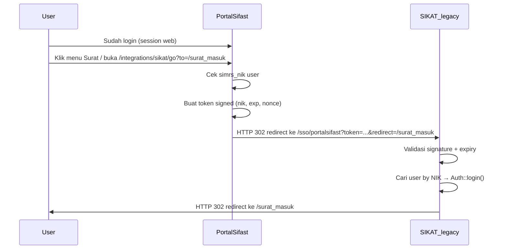

# Integrasi Portal Sifast → SIKAT Legacy (SSO via NIK)

**Versi:** 1.0  
**Status:** Spesifikasi fase 1 — **sisi SIKAT & Portal sudah diimplementasikan** (aktif setelah `PORTALSIFAST_SIKAT_SSO_SECRET` diisi di `.env`)  
**Audience:** Tim Portal Sifast + tim SIKAT legacy

> **Panduan utama (mulai di sini):** [`INTEGRASI_WITH_SIKAT.md`](./INTEGRASI_WITH_SIKAT.md) — alur integrasi, env, contoh kode, checklist, troubleshooting.  
> **Dokumen ini** = spesifikasi kontrak teknis detail & acuan untuk tim SIKAT.

Dokumen ini mendeskripsikan integrasi **sederhana** antara Portal Sifast dan modul Surat Menyurat SIKAT legacy, tanpa mengubah login Portal yang sudah ada.

> **Catatan:** Pendekatan alternatif *shared session* (`APP_KEY` sama, database sama, login `username`) **tidak dipakai** di fase 1. Fase 1 memakai **SSO token + NIK** seperti di [`INTEGRASI_WITH_SIKAT.md`](./INTEGRASI_WITH_SIKAT.md).

---

## 1. Ringkasan

| Aspek | Keputusan fase 1 |
|-------|------------------|
| Login Portal Sifast | **Tetap** email + password (Laravel Fortify) |
| Login SIKAT legacy | Tetap `username` + password (untuk akses langsung) |
| Penghubung identitas | **NIK** (`User.simrs_nik` di Portal = `pegawai.nik` / `users.nik` di SIKAT) |
| Mekanisme SSO | **Token signed sekali pakai** (redirect browser) |
| Modul Surat | Tetap di SIKAT legacy (Blade) — **tidak** di-rewrite ke React |
| Dashboard SIKAT v2 | Diabaikan dulu |

**Tujuan:** User yang sudah login di Portal Sifast bisa membuka halaman Surat di SIKAT **tanpa mengetik password lagi**, selama akun Portal punya `simrs_nik` yang terpetakan ke user SIKAT.

---

## 2. Arsitektur

Portal Sifast dan SIKAT legacy boleh berjalan di **subdomain berbeda**:

| Aplikasi | Domain contoh | Peran |
|----------|---------------|-------|
| Portal Sifast | `https://portalsifast.rsaisyiyahsitifatimah.com` | Login utama, fitur baru |
| SIKAT legacy | `https://sikat.rsaisyiyahsitifatimah.com` | Modul Surat Menyurat (Blade) |

```
Browser
   │
   ├─► portalsifast...  →  Portal Sifast (login email, session sendiri)
   │
   └─► sikat...         →  SIKAT legacy (session sendiri, diisi via SSO)
```

### Alur SSO



**Prinsip:** Tidak ada shared cookie, tidak ada shared database session. Hanya **pertukaran token singkat** yang membawa NIK.

---

## 3. Prasyarat

### 3.1 Portal Sifast

- User login memiliki **`simrs_nik`** terisi (sumber: sync SIMRS, import, atau `POST /api/login` + auto-sync dari email).
- Pola NIK mengikuti standar integrasi kepegawaian: [STANDARD-API-INTEGRASI-KEPEGAWAIAN.md](./STANDARD-API-INTEGRASI-KEPEGAWAIAN.md).

### 3.2 SIKAT legacy

- Tabel `users` (atau mapping) bisa menemukan akun login dari **NIK pegawai**.
- Satu route baru: `GET /sso/portalsifast`.
- Shared secret di `.env` (sama dengan Portal).

> **Blokir utama:** Jika SIKAT hanya punya `username` tanpa relasi ke NIK, tim SIKAT harus menambah kolom `nik` di `users` atau lookup `pegawai.nik` → `users.username` sebelum SSO bisa jalan.

---

## 4. Kontrak token SSO

### 4.1 Format URL redirect

```
GET {SIKAT_BASE_URL}/sso/portalsifast?token={token}&redirect={path}
```

| Parameter | Wajib | Contoh | Keterangan |
|-----------|-------|--------|------------|
| `token` | Ya | `eyJ...`.`a1b2c3...` | Payload base64url + signature HMAC |
| `redirect` | Ya | `/surat_masuk` | Path relatif di SIKAT; **bukan** URL absolut |

**Contoh lengkap:**

```
https://sikat.rsaisyiyahsitifatimah.com/sso/portalsifast
  ?token=eyJuaWsiOiIwMy4wOS4wNy4xOTk4IiwiZXhwIjoxNzE4Njk3NjAwLCJub25jZSI6IjAxOTg3NmE0LTRhYjItNzAwMC1hYmNkLWVmZ2hpamsifQ.a1b2c3d4e5f6
  &redirect=/surat_masuk
```

### 4.2 Payload JSON (sebelum base64url)

```json
{
  "nik": "03.09.07.1998",
  "exp": 1718697600,
  "nonce": "019876a4-4ab2-7000-abcd-efghijklmnop"
}
```

| Field | Tipe | Keterangan |
|-------|------|------------|
| `nik` | string | `User.simrs_nik` dari Portal; format sama dengan `pegawai.nik` SIMRS |
| `exp` | integer | Unix timestamp; token invalid setelah waktu ini |
| `nonce` | string | UUID v4; disarankan single-use di SIKAT |

### 4.3 Pembentukan token (Portal Sifast)

```
payload_json   = JSON.stringify({ nik, exp, nonce })
payload_b64    = base64url_encode(payload_json)
signature      = HMAC_SHA256(payload_b64, PORTALSIFAST_SIKAT_SSO_SECRET)
token          = payload_b64 + "." + hex(signature)
```

Implementasi referensi (PHP):

```php
$payload = [
    'nik' => $user->simrs_nik,
    'exp' => now()->addSeconds(90)->timestamp,
    'nonce' => (string) Str::uuid(),
];
$payloadB64 = rtrim(strtr(base64_encode(json_encode($payload)), '+/', '-_'), '=');
$signature = hash_hmac('sha256', $payloadB64, config('services.sikat.sso_secret'));
$token = $payloadB64.'.'.$signature;
```

### 4.4 Validasi token (SIKAT legacy)

1. Split `token` pada `.` → `payload_b64`, `signature`.
2. Hitung ulang `HMAC_SHA256(payload_b64, secret)` → bandingkan dengan `hash_equals()`.
3. Decode payload → cek `exp` > `time()`.
4. (Disarankan) Cek `nonce` belum pernah dipakai (cache/DB, TTL ≥ 2 menit).
5. Validasi `redirect`:
   - Harus diawali `/`
   - Tidak boleh mengandung `://` (cegah open redirect)
   - Opsional: whitelist prefix (`/surat_masuk`, `/surat_keluar`, …)

### 4.5 Aturan keamanan

| Aturan | Nilai disarankan |
|--------|------------------|
| Masa hidup token | **60–120 detik** |
| Secret | Min. 32 byte random; hanya di `.env`, jangan commit |
| Single-use nonce | Ya (Redis/cache/table `sso_nonces`) |
| HTTPS | Wajib production |
| Log | Jangan log secret atau token lengkap |

---

## 5. Sisi Portal Sifast (spesifikasi)

### 5.1 Environment

```env
# .env Portal Sifast
SIKAT_BASE_URL=https://sikat.rsaisyiyahsitifatimah.com
PORTALSIFAST_SIKAT_SSO_SECRET=   # sama dengan SIKAT, via channel aman
```

```php
// config/services.php (rencana)
'sikat' => [
    'base_url' => env('SIKAT_BASE_URL', 'https://sikat.rsaisyiyahsitifatimah.com'),
    'sso_secret' => env('PORTALSIFAST_SIKAT_SSO_SECRET'),
],
```

### 5.2 Route web (rencana)

| Method | Path | Auth | Perilaku |
|--------|------|------|----------|
| `GET` | `/integrations/sikat/go` | `auth` | Generate token → redirect ke SIKAT |

**Query:**

| Param | Wajib | Contoh |
|-------|-------|--------|
| `to` | Ya | `/surat_masuk` |

**Response sukses:** `302` ke URL SIKAT (lihat §4.1).

**Response gagal:**

| Kondisi | HTTP | Pesan |
|---------|------|-------|
| Belum login | 302 | Ke `/login` |
| `simrs_nik` kosong | 422 / halaman error | "NIK belum terhubung. Hubungi admin." |
| `to` tidak valid | 400 | "Tujuan tidak diizinkan." |
| Secret belum dikonfigurasi | 503 | "Integrasi SIKAT belum siap." |

### 5.3 Whitelist path tujuan (Portal)

Hanya path berikut yang boleh dikirim ke SIKAT (parameter `to`):

```
/surat_masuk
/surat_keluar
/surat_edaran
/spo
/cuti
/ijin
/pengajuan_lembur
/verifikasi_pengajuan_libur
/verifikasi_pengajuan_lembur
/sifat_surat
/klasifikasi_surat
/template_surat
```

Wildcard sub-path (`/surat_masuk/123`) boleh diizinkan jika prefix cocok.

### 5.4 Menu navigasi (frontend)

Gunakan link ke route Portal (bukan langsung ke SIKAT):

```tsx
// Contoh — WAJIB <a> atau <Link> ke route Portal, BUKAN Inertia ke domain SIKAT
<a href="/integrations/sikat/go?to=/surat_masuk">Surat Masuk</a>
<a href="/integrations/sikat/go?to=/surat_keluar">Surat Keluar</a>
```

**Jangan** pakai Inertia `<Link>` ke URL `sikat.rsaisyiyahsitifatimah.com` — itu navigasi lintas aplikasi.

File konfigurasi menu (rencana): `resources/js/config/sikatSuratNav.ts`

---

## 6. Sisi SIKAT legacy (spesifikasi untuk tim SIKAT)

### 6.1 Environment

```env
# .env SIKAT legacy
PORTALSIFAST_SIKAT_SSO_SECRET=   # sama persis dengan Portal
```

### 6.2 Route baru

```php
// routes/web.php (SIKAT legacy) — SUDAH DIIMPLEMENTASIKAN
Route::get('/sso/portalsifast', [PortalSifastSsoController::class, 'handle'])
    ->name('sso.portalsifast');
```

File terkait: `app/Http/Controllers/PortalSifastSsoController.php`, `app/Services/PortalSifastSsoService.php`.

**Tidak** perlu middleware `auth` — endpoint ini yang membuat session.

### 6.3 Controller (pseudocode)

```php
public function handle(Request $request)
{
    $token = $request->query('token');
    $redirect = $request->query('redirect', '/surat_masuk');

    $payload = $this->validateToken($token); // throws jika invalid
    $this->assertSafeRedirect($redirect);

    $user = User::query()
        ->where('nik', $payload['nik'])   // atau mapping pegawai → user
        ->first();

    if (! $user) {
        abort(403, 'Akun SIKAT tidak ditemukan untuk NIK ini.');
    }

    Auth::login($user);
    $request->session()->regenerate();

  $this->markNonceUsed($payload['nonce']);

    return redirect($redirect);
}
```

### 6.4 Mapping user by NIK

Pilih **satu** strategi (tim SIKAT putuskan):

| Strategi | Keterangan |
|----------|------------|
| **A. Kolom `users.nik`** | Tambah kolom `nik` di tabel `users` SIKAT; isi dari data pegawai |
| **B. Join `pegawai`** | `pegawai.nik` → cari `users` via relasi yang sudah ada |
| **C. Username = NIK** | Jika `users.username` selalu sama dengan NIK |

Portal mengirim **`nik`**, bukan `username` atau `email`.

### 6.5 Path legacy yang relevan

Modul yang diakses lewat SSO (sama seperti navbar Surat Menyurat):

```
/surat_masuk, /surat_keluar, /surat_edaran, /spo
/cuti, /ijin, /pengajuan_lembur
/verifikasi_pengajuan_libur, /verifikasi_pengajuan_lembur
/sifat_surat, /klasifikasi_surat, /template_surat
/surat/tampillampiran/*
```

Hak akses (`auth`, `checkAccess:surat.master`, `@can`) tetap ditangani **SIKAT** setelah login — Portal hanya mengirim identitas.

### 6.6 Link balik ke Portal (opsional, UX)

Di navbar Blade legacy:

```blade
<a href="https://portalsifast.rsaisyiyahsitifatimah.com/dashboard" class="side-menu__item">
    Portal Sifast
</a>
```

---

## 7. Alternatif: verifikasi token via API Portal

Jika tim SIKAT **tidak ingin** menyimpan shared secret di legacy, Portal bisa menyediakan endpoint verifikasi:

### `POST /api/sifast/sso/verify`

**Auth:** Bearer token service (Sanctum) — akun integrasi, bukan user pegawai.

**Request:**

```json
{
  "token": "eyJ....a1b2c3"
}
```

**Response `200`:**

```json
{
  "success": true,
  "data": {
    "nik": "03.09.07.1998",
    "name": "Ahmad Fauzi",
    "exp": 1718697600
  }
}
```

**Response `401`:**

```json
{
  "success": false,
  "message": "Token tidak valid atau sudah kedaluwarsa."
}
```

**Trade-off:**

| | HMAC lokal (§4) | API verify (§7) |
|--|-----------------|-----------------|
| Secret di SIKAT | Ya | Tidak |
| Dependency network | Tidak | Ya (SIKAT → Portal) |
| Kecepatan | Lebih cepat | +1 HTTP round-trip |

**Rekomendasi fase 1:** HMAC lokal (lebih sederhana, tidak butuh SIKAT call API saat setiap klik menu).

---

## 8. Checklist implementasi

### Tim Portal Sifast

- [x] `PORTALSIFAST_SIKAT_SSO_SECRET` + `SIKAT_BASE_URL` di `.env`
- [x] Service `SikatSsoTokenService` (generate + validate untuk testing)
- [x] Controller `SikatSsoRedirectController` + route `/integrations/sikat/go`
- [x] Whitelist path `to`
- [x] Guard: tolak jika `simrs_nik` kosong
- [x] Menu Surat di sidebar (`sikatSuratNav.ts`)
- [x] Feature test: user dengan NIK → redirect URL benar; tanpa NIK → error

### Tim SIKAT legacy

- [x] Konfirmasi mapping **NIK → user login**
- [x] Route `GET /sso/portalsifast`
- [x] Validasi HMAC + expiry + nonce
- [x] `Auth::login()` + redirect aman
- [x] (Opsional) Link balik ke Portal
- [ ] Test manual di staging

---

## 9. Checklist testing (staging)

- [ ] Login Portal dengan user yang punya `simrs_nik`
- [ ] Buka `/integrations/sikat/go?to=/surat_masuk`
- [ ] **Ekspektasi:** landing di `/surat_masuk` SIKAT tanpa form login
- [ ] Ulangi: Surat Keluar, Surat Edaran, SPO
- [ ] User Portal **tanpa** `simrs_nik` → pesan error jelas
- [ ] Token kedaluwarsa (tunggu >2 menit) → SIKAT tolak
- [ ] Token dipakai dua kali (jika single-use) → percobaan kedua ditolak
- [ ] `redirect` jahat (`https://evil.com`) → ditolak
- [ ] Akun Kabag: `/sifat_surat` bisa dibuka setelah SSO
- [ ] Akun non-Kabag: `/sifat_surat` → 403 (normal, dari SIKAT)
- [ ] Logout Portal → session SIKAT legacy **tetap** (terpisah); itu expected
- [ ] Login langsung SIKAT (`username`) tetap berfungsi

---

## 10. Troubleshooting

| Gejala | Penyebab umum | Solusi |
|--------|---------------|--------|
| Redirect ke login SIKAT | Token invalid / user tidak ketemu by NIK | Cek secret sama; mapping NIK di `users` SIKAT |
| "NIK belum terhubung" di Portal | `simrs_nik` kosong | Sync dari SIMRS atau isi manual di admin |
| 403 setelah SSO | User ketemu tapi tidak punya hak modul | Normal — atur role/level di SIKAT |
| 400 redirect | Path `to` tidak di whitelist Portal | Perbaiki param atau tambah ke whitelist |
| Signature mismatch | Secret beda antar app | Samakan `PORTALSIFAST_SIKAT_SSO_SECRET` |
| Token expired | User lambat / jam server beda | Perpanjang TTL sedikit; sync NTP server |

### Debug cepat (Portal)

```bash
php artisan tinker --execute="
\$u = App\Models\User::whereNotNull('simrs_nik')->first();
echo \$u?->simrs_nik ?? 'no user';
"
```

### Debug cepat (SIKAT)

```sql
SELECT id, username, nik FROM users WHERE nik = '03.09.07.1998' LIMIT 1;
```

---

## 11. Perbandingan dengan shared session (alternatif — tidak dipakai)

| | Shared session (alternatif, tidak diimplementasikan) | SSO token + NIK (fase 1 — [`INTEGRASI_WITH_SIKAT.md`](./INTEGRASI_WITH_SIKAT.md)) |
|--|------------------------------------------------------|-------------------------------------------------------------------------------------|
| Ubah login Portal | Ya (`username`) | **Tidak** |
| Database sama | Wajib (`sikat`) | **Tidak** |
| `APP_KEY` sama | Wajib | **Tidak** |
| Subdomain terpisah | Ribet | **Didukung** |
| Kerja tim SIKAT | Nginx + env banyak | **1 endpoint + mapping NIK** |
| Cocok untuk | Migrasi penuh ke satu domain | **Integrasi cepat fase 1** |

---

## 12. Yang tidak perlu dilakukan (fase 1)

- Rewrite UI Surat ke React/Inertia
- Shared session / cookie `sikat_session`
- Samakan tabel `users` Portal dan SIKAT
- Embed halaman legacy di iframe
- API proxy untuk setiap aksi surat

---

## 13. Koordinasi antar tim

Sebelum production:

1. **Portal** generate secret → kirim ke **SIKAT** via channel aman (bukan commit git).
2. **SIKAT** konfirmasi strategi mapping NIK → `users` (§6.4).
3. Set URL production: `SIKAT_BASE_URL`.
4. Uji di staging dengan akun nyata (minimal: pegawai biasa + Kabag).
5. Setelah stabil, pertimbangkan fase 2 (shared domain / menu lebih rapi) jika diperlukan.

---

## 15. SSO balik: SIKAT → Portal Sifast

Portal menyediakan endpoint inbound:

```
GET {PORTALSIFAST_BASE_URL}/sso/sikat?token={token}&redirect={path}
```

Algoritma token **identik** dengan Portal → SIKAT (secret sama, payload `nik` + `exp` + `nonce`).

| Sisi | Endpoint / aksi |
|------|-----------------|
| Portal (sudah ada) | `GET /sso/sikat` — validasi token, `Auth::login()` by `simrs_nik` |
| SIKAT (tim SIKAT implement) | Generate token + ubah link navbar "Portal Sifast" |

**Panduan lengkap untuk developer SIKAT:** [SIKAT_DEVELOPER_SSO_KE_PORTAL.md](./SIKAT_DEVELOPER_SSO_KE_PORTAL.md)

---

## 16. Referensi terkait

| Dokumen | Isi |
|---------|-----|
| [**INTEGRASI_WITH_SIKAT.md**](./INTEGRASI_WITH_SIKAT.md) | **Panduan integrasi utama** — mulai dari sini |
| [**INTEGRASI_SIKAT_SSO.md**](./INTEGRASI_SIKAT_SSO.md) | Spesifikasi kontrak teknis detail (dokumen ini) |
| [**SIKAT_DEVELOPER_SSO_KE_PORTAL.md**](./SIKAT_DEVELOPER_SSO_KE_PORTAL.md) | Panduan tim SIKAT: SSO ke Portal |
| [STANDARD-API-INTEGRASI-KEPEGAWAIAN.md](./STANDARD-API-INTEGRASI-KEPEGAWAIAN.md) | Aturan NIK di API Portal |
| [api-documentation.md](./api-documentation.md) | `simrs_nik` di response login/user |
| [API-TICKETING.md](./API-TICKETING.md) | Pola `?nik=` untuk integrasi eksternal |

---

*Dokumen ini untuk tim pengembang Portal Sifast dan tim SIKAT legacy. Terakhir diperbarui: Juni 2026.*
