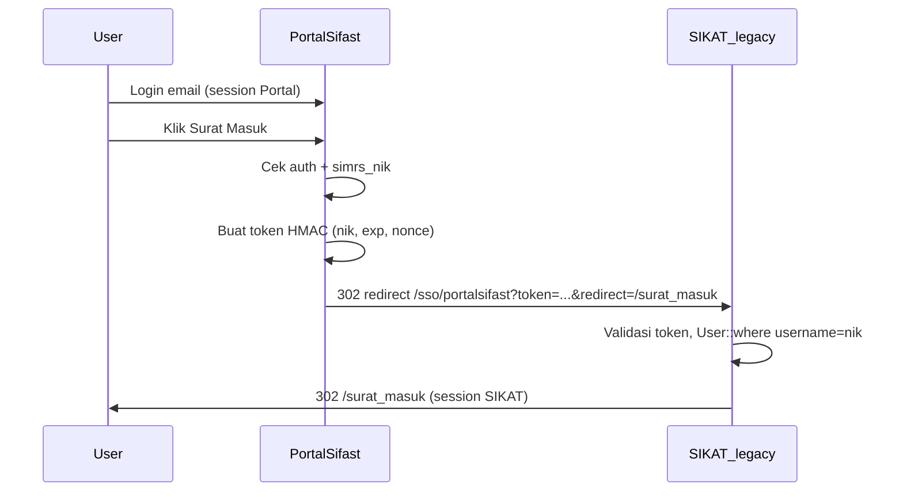

# Panduan Integrasi Portal Sifast → Surat Menyurat SIKAT

**Audience:** Tim pengembang **Portal Sifast**  
**Status:** Sisi SIKAT **dan Portal sudah diimplementasikan** — aktif setelah `PORTALSIFAST_SIKAT_SSO_SECRET` diisi di `.env`  
**Versi:** 1.2 — Juni 2026

> **Hierarki dokumen integrasi SIKAT:**
> - **[INTEGRASI_WITH_SIKAT.md](./INTEGRASI_WITH_SIKAT.md)** (berkas ini) — panduan utama: alur, env, kode, checklist, troubleshooting.
> - **[INTEGRASI_SIKAT_SSO.md](./INTEGRASI_SIKAT_SSO.md)** — spesifikasi kontrak teknis detail untuk tim SIKAT & Portal.
>
> *(Nama berkas di atas yang benar. Jangan pakai nama lama `SIKAT_V2_INTEGRASI_SURAT_MENYURAT` — itu salah ketik.)*

---

## 1. Ringkasan

| Item | Nilai |
|------|-------|
| Login Portal | Tetap **email + password** (Fortify) — tidak diubah |
| Modul Surat | Tetap di **SIKAT legacy** (Blade) — tidak di-rewrite ke React |
| SSO | Token signed sekali pakai, berisi **NIK** |
| Endpoint SIKAT | `GET {SIKAT_BASE_URL}/sso/portalsifast` — **sudah live** |
| Yang Portal buat | `GET /integrations/sikat/go?to=...` + menu navbar |

**Yang TIDAK perlu:** `APP_KEY` sama, database sama, ubah login ke `username`, atau Nginx routing rumit.

---

## 2. Alur lengkap



---

## 3. Environment Portal Sifast

Tambahkan di `.env`:

```env
SIKAT_BASE_URL=https://sikat.rsaisyiyahsitifatimah.com
PORTALSIFAST_SIKAT_SSO_SECRET=   # SAMA PERSIS dengan .env SIKAT — jangan commit ke git
```

Tambahkan di `config/services.php`:

```php
'sikat' => [
    'base_url' => env('SIKAT_BASE_URL', 'https://sikat.rsaisyiyahsitifatimah.com'),
    'sso_secret' => env('PORTALSIFAST_SIKAT_SSO_SECRET'),
],
```

> **Koordinasi:** Minta nilai `PORTALSIFAST_SIKAT_SSO_SECRET` ke admin SIKAT lewat channel aman (WhatsApp internal, bukan email/git).

---

## 4. Format token SSO (wajib sama persis)

### 4.1 URL redirect ke SIKAT

```
{SIKAT_BASE_URL}/sso/portalsifast?token={token}&redirect={path}
```

**Contoh:**

```
https://sikat.rsaisyiyahsitifatimah.com/sso/portalsifast
  ?token=eyJuaWsiOiIwMy4wOS4wNy4xOTk4IiwiZXhwIjoxNzE4Njk3NjAwLCJub25jZSI6IjAxOTg3NmE0In0.a1b2c3...
  &redirect=/surat_masuk
```

| Parameter | Wajib | Keterangan |
|-----------|-------|------------|
| `token` | Ya | Payload base64url + `.` + signature hex HMAC |
| `redirect` | Ya | Path relatif SIKAT, diawali `/` — **bukan** URL absolut |

### 4.2 Payload JSON

```json
{
  "nik": "03.09.07.1998",
  "exp": 1718697600,
  "nonce": "019876a4-4ab2-7000-abcd-efghijklmnop"
}
```

| Field | Keterangan |
|-------|------------|
| `nik` | `User.simrs_nik` dari user yang login di Portal |
| `exp` | Unix timestamp — disarankan `now() + 90` hingga `120` detik |
| `nonce` | UUID v4 unik per request |

### 4.3 Algoritma pembentukan token

```
payload_json = JSON.stringify({ nik, exp, nonce })
payload_b64  = base64url_encode(payload_json)   // tanpa padding =, ganti +/ dengan -_
signature    = HMAC_SHA256(payload_b64, PORTALSIFAST_SIKAT_SSO_SECRET)  // output hex
token        = payload_b64 + "." + signature
```

### 4.4 Implementasi PHP (copy ke Portal)

**Service:** `app/Services/SikatSsoTokenService.php`

```php
<?php

namespace App\Services;

use Illuminate\Support\Str;
use InvalidArgumentException;

class SikatSsoTokenService
{
    /** @var list<string> */
    private const ALLOWED_PATHS = [
        '/surat_masuk',
        '/surat_keluar',
        '/surat_edaran',
        '/spo',
        '/cuti',
        '/ijin',
        '/pengajuan_lembur',
        '/verifikasi_pengajuan_libur',
        '/verifikasi_pengajuan_lembur',
        '/sifat_surat',
        '/klasifikasi_surat',
        '/template_surat',
    ];

    public function isConfigured(): bool
    {
        $secret = config('services.sikat.sso_secret');

        return is_string($secret) && $secret !== '';
    }

    public function assertAllowedPath(string $path): string
    {
        if (! str_starts_with($path, '/') || str_contains($path, '://')) {
            throw new InvalidArgumentException('Tujuan tidak diizinkan.');
        }

        foreach (self::ALLOWED_PATHS as $allowed) {
            if ($path === $allowed || str_starts_with($path, $allowed.'/')) {
                return $path;
            }
        }

        throw new InvalidArgumentException('Tujuan tidak diizinkan.');
    }

    public function buildRedirectUrl(string $nik, string $redirectPath): string
    {
        if (! $this->isConfigured()) {
            throw new InvalidArgumentException('Integrasi SIKAT belum dikonfigurasi.');
        }

        $redirectPath = $this->assertAllowedPath($redirectPath);

        $payload = [
            'nik' => $nik,
            'exp' => now()->addSeconds(90)->timestamp,
            'nonce' => (string) Str::uuid(),
        ];

        $payloadB64 = rtrim(strtr(base64_encode(json_encode($payload)), '+/', '-_'), '=');
        $signature = hash_hmac('sha256', $payloadB64, (string) config('services.sikat.sso_secret'));
        $token = $payloadB64.'.'.$signature;

        $base = rtrim((string) config('services.sikat.base_url'), '/');

        return $base.'/sso/portalsifast'
            .'?token='.urlencode($token)
            .'&redirect='.urlencode($redirectPath);
    }
}
```

**Controller:** `app/Http/Controllers/Integrations/SikatSsoRedirectController.php`

```php
<?php

namespace App\Http\Controllers\Integrations;

use App\Http\Controllers\Controller;
use App\Services\SikatSsoTokenService;
use Illuminate\Http\Request;
use InvalidArgumentException;

class SikatSsoRedirectController extends Controller
{
    public function __construct(
        private SikatSsoTokenService $sso
    ) {
    }

    public function go(Request $request)
    {
        $user = $request->user();
        if (! $user) {
            return redirect()->route('login');
        }

        if (! $this->sso->isConfigured()) {
            abort(503, 'Integrasi SIKAT belum siap.');
        }

        $nik = $user->simrs_nik ?? null;
        if (! is_string($nik) || $nik === '') {
            abort(422, 'NIK belum terhubung. Hubungi admin atau jalankan sync SIMRS.');
        }

        try {
            $to = $this->sso->assertAllowedPath($request->query('to', '/surat_masuk'));
            $url = $this->sso->buildRedirectUrl($nik, $to);
        } catch (InvalidArgumentException $e) {
            abort(400, $e->getMessage());
        }

        return redirect()->away($url);
    }
}
```

**Route:** `routes/web.php`

```php
use App\Http\Controllers\Integrations\SikatSsoRedirectController;

Route::middleware('auth')->group(function () {
    Route::get('/integrations/sikat/go', [SikatSsoRedirectController::class, 'go'])
        ->name('integrations.sikat.go');
});
```

---

## 5. Menu navbar (TSX)

Buat `resources/js/config/sikatSuratNav.ts`:

```ts
export type SikatSuratNavItem = {
  label: string;
  to: string;
};

export const sikatSuratNav: SikatSuratNavItem[] = [
  { label: 'Surat Masuk', to: '/surat_masuk' },
  { label: 'Surat Keluar', to: '/surat_keluar' },
  { label: 'Surat Edaran', to: '/surat_edaran' },
  { label: 'SPO', to: '/spo' },
];

export const sikatSuratCutiNav: SikatSuratNavItem[] = [
  { label: 'Pengajuan Cuti / Libur', to: '/cuti' },
  { label: 'Verifikasi Cuti / Libur', to: '/verifikasi_pengajuan_libur' },
];

export const sikatSuratIjinNav: SikatSuratNavItem[] = [
  { label: 'Pengajuan Ijin', to: '/ijin' },
];

export const sikatSuratLemburNav: SikatSuratNavItem[] = [
  { label: 'Pengajuan Lembur', to: '/pengajuan_lembur' },
  { label: 'Verifikasi Lembur', to: '/verifikasi_pengajuan_lembur' },
];

export const sikatSuratMasterNav: SikatSuratNavItem[] = [
  { label: 'Sifat Surat', to: '/sifat_surat' },
  { label: 'Klasifikasi Surat', to: '/klasifikasi_surat' },
];
```

Komponen menu:

```tsx
import { sikatSuratNav } from '@/config/sikatSuratNav';

export function SikatSuratMenu() {
  return (
    <div className="nav-group">
      <span className="nav-group-label">Surat Menyurat</span>
      <ul>
        {sikatSuratNav.map((item) => (
          <li key={item.to}>
            {/* WAJIB ke route Portal — BUKAN link langsung ke domain SIKAT */}
            <a
              href={`/integrations/sikat/go?to=${encodeURIComponent(item.to)}`}
              className="nav-link"
            >
              {item.label}
            </a>
          </li>
        ))}
      </ul>
    </div>
  );
}
```

> **Jangan** pakai Inertia `<Link>` ke `sikat.rsaisyiyahsitifatimah.com` — gunakan `<a href="/integrations/sikat/go?...">` agar browser ikut redirect SSO.

---

## 6. Prasyarat: `simrs_nik` harus terisi

SSO mengirim **NIK**, bukan email. Field `User.simrs_nik` di Portal wajib ada.

### Manfaatkan `users:sync-simrs` yang sudah ada

Command Portal:

```bash
php artisan users:sync-simrs --dry-run   # cek dulu
php artisan users:sync-simrs             # jalankan sync
```

Pastikan action sync mengisi:

```php
'simrs_nik' => $pegawai->nik,
```

**Rantai identitas:**

```
pegawai.nik (SIMRS)  →  Portal.users.simrs_nik  →  token SSO  →  SIKAT.users.username
```

Di SIKAT, `users.username` = NIK (konvensi saat buat user admin). Format harus **identik** (contoh: `03.09.07.1998`).

---

## 7. Status sisi SIKAT (sudah diimplementasikan)

Tim Portal **tidak perlu** mengubah kode SIKAT. Yang sudah ada:

| Komponen | Lokasi |
|----------|--------|
| Endpoint SSO | `GET /sso/portalsifast` |
| Controller | `app/Http/Controllers/PortalSifastSsoController.php` |
| Validasi token | `app/Services/PortalSifastSsoService.php` |
| Lookup user | `User::where('username', $nik)` |
| Link balik | Menu **Portal Sifast** di navbar SIKAT |
| Uji manual SIKAT | `php artisan portalsifast:sso-test-url {NIK}` |

**Validasi SIKAT pada token:**

- Signature HMAC-SHA256 (hex)
- `exp` belum lewat
- `nonce` sekali pakai (cache 120 detik)
- `redirect` harus path relatif & ada di whitelist

---

## 8. Checklist implementasi Portal

- [x] `SIKAT_BASE_URL` + `PORTALSIFAST_SIKAT_SSO_SECRET` di `.env` (secret sama dengan SIKAT)
- [x] Entry `config/services.php` → `sikat`
- [x] `SikatSsoTokenService` + `SikatSsoRedirectController`
- [x] Route `GET /integrations/sikat/go` (middleware `auth`)
- [x] Menu TSX `sikatSuratNav.ts` + komponen sidebar
- [x] Guard: tolak jika `simrs_nik` kosong
- [x] Whitelist path `to` (jangan kirim path sembarang)
- [ ] Jadwalkan `users:sync-simrs` rutin (cron)
- [x] Feature test: user dengan NIK → redirect URL benar

---

## 9. Checklist testing

### Di Portal (setelah implement)

- [ ] Login dengan user yang punya `simrs_nik`
- [ ] Klik Surat Masuk → landing di `https://sikat.../surat_masuk` **tanpa** form login
- [ ] User tanpa `simrs_nik` → pesan error jelas
- [ ] `to` tidak valid (mis. `/admin`) → HTTP 400

### Verifikasi silang NIK

```sql
-- Portal DB
SELECT email, simrs_nik FROM users WHERE email = 'user@contoh.com';

-- SIKAT DB (koordinasi tim SIKAT)
SELECT username, name, level FROM users WHERE username = '03.09.07.1998';
```

NIK harus cocok. Jika ada di Portal tapi tidak di SIKAT → SSO gagal 403 (perlu buat akun SIKAT).

---

## 10. Troubleshooting

| Gejala | Penyebab | Solusi |
|--------|----------|--------|
| 403 "Signature token SSO tidak valid" | Secret beda | Samakan `PORTALSIFAST_SIKAT_SSO_SECRET` |
| 403 "Token SSO sudah kedaluwarsa" | User lambat / jam server beda | Token 90–120 detik; sync NTP |
| 403 "Token SSO sudah pernah digunakan" | URL dibuka 2× / refresh | Generate token baru (klik menu lagi) |
| 403 "Akun SIKAT tidak ditemukan" | NIK tidak ada di `users` SIKAT | Buat akun SIKAT, `username` = NIK |
| 422 di Portal | `simrs_nik` kosong | Jalankan `users:sync-simrs` |
| 400 "Tujuan tidak diizinkan" | Path `to` di luar whitelist | Perbaiki param `to` |
| 503 di Portal/SIKAT | Secret belum diisi | Isi `.env` + `config:clear` |

---

## 11. Keamanan

| Aturan | Nilai |
|--------|-------|
| Masa hidup token | 60–120 detik |
| Nonce | UUID unik per klik |
| Secret | Min. 32 karakter random; **jangan** commit git |
| HTTPS | Wajib production |
| Log | Jangan log secret atau token lengkap |

---

## 12. FAQ

**Apakah `PORTALSIFAST_SIKAT_SSO_SECRET` itu token?**  
Tidak. Itu kunci rahasia untuk **menandatangani** token. Token dibuat baru setiap klik menu.

**Bisa pakai metode API Absensi (Sanctum Bearer)?**  
Tidak untuk buka halaman Surat Blade. Sanctum untuk JSON API mobile; Surat butuh session web browser.

**Logout Portal apakah logout SIKAT juga?**  
Tidak. Session terpisah — itu normal. User bisa tetap login SIKAT sampai session SIKAT expire.

**Subdomain beda boleh?**  
Ya. Portal di `portalsifast...`, SIKAT di `sikat...` — SSO via redirect browser.

**Bisa SSO dari SIKAT ke Portal (tanpa login ulang)?**  
Ya. Portal menyediakan `GET /sso/sikat`. Panduan lengkap untuk tim SIKAT: **[SIKAT_DEVELOPER_SSO_KE_PORTAL.md](./SIKAT_DEVELOPER_SSO_KE_PORTAL.md)**.

---

## 13. Referensi

| Dokumen / file | Isi |
|----------------|-----|
| [**INTEGRASI_SIKAT_SSO.md**](./INTEGRASI_SIKAT_SSO.md) | Spesifikasi kontrak teknis detail + perbandingan alternatif |
| [**SIKAT_DEVELOPER_SSO_KE_PORTAL.md**](./SIKAT_DEVELOPER_SSO_KE_PORTAL.md) | Panduan tim SIKAT: SSO balik ke Portal (`GET /sso/sikat`) |
| SIKAT `PortalSifastSsoService.php` | Implementasi validasi di sisi SIKAT (acuan algoritma) |

---

*Dokumen ini untuk tim Portal Sifast. Integrasi SSO fase 1 sudah diimplementasikan di kedua sisi; aktif setelah secret diisi di `.env`.*
