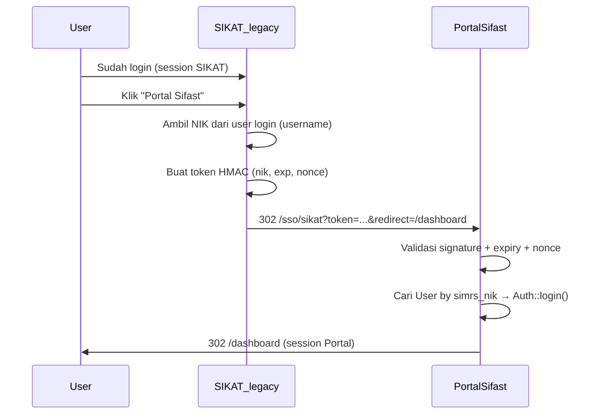

# SSO SIKAT → Portal Sifast (Panduan Developer SIKAT)

**Audience:** Tim pengembang **SIKAT legacy** (Laravel 8 + Blade)  
**Versi:** 1.0 — Juni 2026  
**Status:** Endpoint Portal **`GET /sso/sikat`** sudah siap di sisi Portal Sifast

Dokumen ini menjelaskan cara mengarahkan user yang **sudah login di SIKAT** ke Portal Sifast **tanpa login ulang** — kebalikan dari integrasi Portal → SIKAT yang sudah ada.

**Dokumen terkait:**

| Dokumen | Isi |
|---------|-----|
| [INTEGRASI_WITH_SIKAT.md](./INTEGRASI_WITH_SIKAT.md) | Panduan integrasi utama (Portal → SIKAT) |
| [INTEGRASI_SIKAT_SSO.md](./INTEGRASI_SIKAT_SSO.md) | Spesifikasi kontrak token SSO (kedua arah) |

---

## 1. Ringkasan

| Item | Nilai |
|------|-------|
| Arah | **SIKAT → Portal Sifast** |
| Endpoint Portal | `GET {PORTALSIFAST_BASE_URL}/sso/sikat` |
| Secret | `PORTALSIFAST_SIKAT_SSO_SECRET` — **sama** dengan SSO Portal → SIKAT |
| Identitas | **NIK** (`users.username` di SIKAT = `users.simrs_nik` di Portal) |
| Login Portal | Otomatis via session web setelah token valid |

**Yang SIKAT buat:**

1. Service generate token (algoritma identik dengan yang dipakai Portal ke SIKAT)
2. Ubah link menu **Portal Sifast** di navbar Blade → URL SSO (bukan link langsung ke `/dashboard`)
3. (Opsional) Artisan command untuk uji manual

---

## 2. Alur



---

## 3. Environment SIKAT

Tambahkan (atau pastikan sudah ada):

```env
PORTALSIFAST_BASE_URL=https://portalsifast.rsaisyiyahsitifatimah.com
PORTALSIFAST_SIKAT_SSO_SECRET=   # SAMA PERSIS dengan Portal & secret outbound SSO
```

Di `config/services.php` (SIKAT):

```php
'portalsifast' => [
    'base_url' => env('PORTALSIFAST_BASE_URL', 'https://portalsifast.rsaisyiyahsitifatimah.com'),
    'sso_secret' => env('PORTALSIFAST_SIKAT_SSO_SECRET'),
],
```

---

## 4. Format URL redirect ke Portal

```
GET {PORTALSIFAST_BASE_URL}/sso/sikat?token={token}&redirect={path}
```

**Contoh:**

```
https://portalsifast.rsaisyiyahsitifatimah.com/sso/sikat
  ?token=eyJuaWsiOiIwMy4wOS4wNy4xOTk4IiwiZXhwIjoxNzE4Njk3NjAwLCJub25jZSI6IjAxOTg3NmE0In0.a1b2c3d4e5f6
  &redirect=/dashboard
```

| Parameter | Wajib | Keterangan |
|-----------|-------|------------|
| `token` | Ya | Payload base64url + `.` + signature hex HMAC-SHA256 |
| `redirect` | Tidak | Path relatif Portal; default `/dashboard` |

---

## 5. Kontrak token (identik dengan Portal → SIKAT)

### 5.1 Payload JSON

```json
{
  "nik": "03.09.07.1998",
  "exp": 1718697600,
  "nonce": "019876a4-4ab2-7000-abcd-efghijklmnop"
}
```

| Field | Keterangan |
|-------|------------|
| `nik` | `Auth::user()->username` di SIKAT (harus = NIK pegawai) |
| `exp` | Unix timestamp — disarankan `now() + 90` detik |
| `nonce` | UUID v4 unik **per klik** |

### 5.2 Algoritma

```
payload_json = json_encode({ nik, exp, nonce })
payload_b64  = base64url(payload_json)     // tanpa padding =, ganti +/ → -_
signature    = HMAC_SHA256(payload_b64, PORTALSIFAST_SIKAT_SSO_SECRET)  // hex
token        = payload_b64 + "." + signature
```

### 5.3 Implementasi PHP di SIKAT (copy)

**Service:** `app/Services/PortalsifastSsoOutboundService.php`

```php
<?php

namespace App\Services;

use Illuminate\Support\Str;
use InvalidArgumentException;

class PortalsifastSsoOutboundService
{
    /** @var list<string> */
    private const ALLOWED_REDIRECTS = [
        '/dashboard',
        '/tickets',
        '/tickets/create',
        '/tickets/board',
        '/chat',
        '/pegawai',
        '/catatan',
        '/reports',
        '/projects',
        '/emergency-reports',
        '/payroll',
        '/payroll/dashboard',
        '/inventaris',
        '/simmutu',
    ];

    public function isConfigured(): bool
    {
        $secret = config('services.portalsifast.sso_secret');

        return is_string($secret) && $secret !== '';
    }

    public function buildRedirectUrl(string $nik, string $redirectPath = '/dashboard'): string
    {
        if (! $this->isConfigured()) {
            throw new InvalidArgumentException('Integrasi Portal Sifast belum dikonfigurasi.');
        }

        $redirectPath = $this->assertAllowedPath($redirectPath);

        $payload = [
            'nik' => $nik,
            'exp' => now()->addSeconds(90)->timestamp,
            'nonce' => (string) Str::uuid(),
        ];

        $payloadB64 = rtrim(strtr(base64_encode(json_encode($payload)), '+/', '-_'), '=');
        $signature = hash_hmac('sha256', $payloadB64, (string) config('services.portalsifast.sso_secret'));
        $token = $payloadB64.'.'.$signature;

        $base = rtrim((string) config('services.portalsifast.base_url'), '/');

        return $base.'/sso/sikat'
            .'?token='.urlencode($token)
            .'&redirect='.urlencode($redirectPath);
    }

    public function assertAllowedPath(string $path): string
    {
        if (! str_starts_with($path, '/') || str_contains($path, '://')) {
            throw new InvalidArgumentException('Tujuan tidak diizinkan.');
        }

        foreach (self::ALLOWED_REDIRECTS as $allowed) {
            if ($path === $allowed || str_starts_with($path, $allowed.'/')) {
                return $path;
            }
        }

        throw new InvalidArgumentException('Tujuan tidak diizinkan.');
    }
}
```

---

## 6. Navbar Blade SIKAT

**Sebelum (login ulang di Portal):**

```blade
<a href="https://portalsifast.rsaisyiyahsitifatimah.com/dashboard" class="side-menu__item">
    Portal Sifast
</a>
```

**Sesudah (SSO tanpa login ulang):**

```blade
@php
    $portalSsoUrl = app(\App\Services\PortalsifastSsoOutboundService::class)
        ->buildRedirectUrl(auth()->user()->username, '/dashboard');
@endphp

<a href="{{ $portalSsoUrl }}" class="side-menu__item">
    Portal Sifast
</a>
```

> **WAJIB** `<a href="...">` — jangan AJAX. Browser harus mengikuti redirect penuh ke domain Portal.

### Link ke halaman tertentu Portal

```blade
{{-- Contoh: buka daftar tiket --}}
<a href="{{ app(\App\Services\PortalsifastSsoOutboundService::class)
    ->buildRedirectUrl(auth()->user()->username, '/tickets') }}">
    Tiket Portal
</a>
```

---

## 7. Path `redirect` yang diizinkan Portal

Hanya path berikut (dan sub-path-nya) yang diterima Portal:

```
/dashboard
/tickets
/tickets/create
/tickets/board
/chat
/pegawai
/catatan
/reports
/projects
/emergency-reports
/payroll
/payroll/dashboard
/inventaris
/simmutu
```

Contoh sub-path valid: `/tickets/42`, `/chat/5`

Path di luar whitelist → HTTP **400** dari Portal.

---

## 8. Validasi di sisi Portal (sudah diimplementasikan)

Portal menolak token jika:

| Cek | Respons |
|-----|---------|
| Secret belum dikonfigurasi | 503 |
| Token kosong / format salah | 400 / 403 |
| Signature tidak cocok | 403 |
| `exp` sudah lewat | 403 |
| `nonce` sudah pernah dipakai | 403 |
| `redirect` tidak di whitelist | 400 |
| NIK tidak ada di `users.simrs_nik` Portal | 403 |

Jika user belum ada di Portal tapi ada di SIMRS, Portal **bisa** auto-create user (role `pemohon`) — sama seperti API tiket.

---

## 9. Mapping NIK

```
SIKAT.users.username  =  pegawai.nik  =  Portal.users.simrs_nik
```

**Contoh verifikasi silang:**

```sql
-- SIKAT
SELECT username, name, level FROM users WHERE username = '03.09.07.1998';

-- Portal (koordinasi tim Portal)
SELECT email, simrs_nik, name FROM users WHERE simrs_nik = '03.09.07.1998';
```

NIK harus **identik** (format titik, huruf, dll.).

---

## 10. Checklist implementasi SIKAT

- [ ] `PORTALSIFAST_BASE_URL` + `PORTALSIFAST_SIKAT_SSO_SECRET` di `.env` (secret sama dengan outbound SSO)
- [ ] `PortalsifastSsoOutboundService` (generate token + build URL)
- [ ] Ubah link navbar **Portal Sifast** ke URL SSO
- [ ] Pastikan `auth()->user()->username` = NIK pegawai
- [ ] (Opsional) `php artisan portalsifast:sso-outbound-test {NIK}` untuk debug
- [ ] Uji manual di staging (lihat §11)

---

## 11. Checklist testing

- [ ] Login SIKAT dengan user yang `username` = NIK valid
- [ ] Klik **Portal Sifast** di navbar
- [ ] **Ekspektasi:** landing di `/dashboard` Portal **tanpa** form login
- [ ] Ulangi dengan `redirect=/tickets`
- [ ] Buka URL SSO yang sama 2× → percobaan kedua **403** (nonce sekali pakai)
- [ ] User tanpa akun Portal → 403 atau auto-create (tergantung data SIMRS)
- [ ] Logout Portal → session SIKAT **tetap** (terpisah, normal)

### Uji cepat tanpa navbar

Setelah service dibuat, generate URL di tinker SIKAT:

```php
app(\App\Services\PortalsifastSsoOutboundService::class)
    ->buildRedirectUrl('03.09.07.1998', '/dashboard');
```

Buka URL di browser (dalam 90 detik).

---

## 12. Troubleshooting

| Gejala | Penyebab | Solusi |
|--------|----------|--------|
| 403 Signature tidak valid | Secret beda | Samakan `PORTALSIFAST_SIKAT_SSO_SECRET` |
| 403 Token kedaluwarsa | URL dibuka lambat | Generate URL baru; sync jam server (NTP) |
| 403 Token sudah pernah digunakan | Refresh / double-click | Klik menu lagi |
| 403 Akun Portal tidak ditemukan | NIK tidak ada di Portal | Jalankan sync user Portal atau buat akun |
| 400 Tujuan tidak diizinkan | `redirect` di luar whitelist | Pakai path dari §7 |
| 503 Integrasi belum siap | Secret kosong di Portal | Isi `.env` Portal + `config:clear` |

---

## 13. Keamanan

| Aturan | Nilai |
|--------|-------|
| Masa hidup token | 60–120 detik |
| Nonce | UUID baru setiap klik menu |
| Secret | Min. 32 karakter; jangan commit git |
| HTTPS | Wajib production |
| `redirect` | Hanya path relatif `/...` |

---

## 14. FAQ

**Apakah secret berbeda dengan SSO Portal → SIKAT?**  
Tidak. **Satu secret** untuk kedua arah.

**Logout SIKAT apakah logout Portal?**  
Tidak. Session terpisah per aplikasi.

**Bisa pakai Sanctum Bearer?**  
Tidak untuk buka halaman Inertia Portal. Butuh session web browser seperti SSO inbound ini.

**Perlu ubah kode Portal lagi?**  
Tidak. Endpoint `GET /sso/sikat` sudah live setelah deploy Portal terbaru.

---

## 15. Diagram dua arah

```
Portal Sifast                          SIKAT legacy
     │                                      │
     │  GET /integrations/sikat/go          │
     │  ───────── token NIK ──────────────► │  /sso/portalsifast
     │                                      │
     │  GET /sso/sikat                      │
     │  ◄──────── token NIK ─────────────── │  navbar "Portal Sifast"
     │                                      │
```

---

*Dokumen ini untuk tim developer SIKAT. Pertanyaan teknis ke tim Portal Sifast: konfirmasi secret & mapping NIK di staging sebelum production.*
